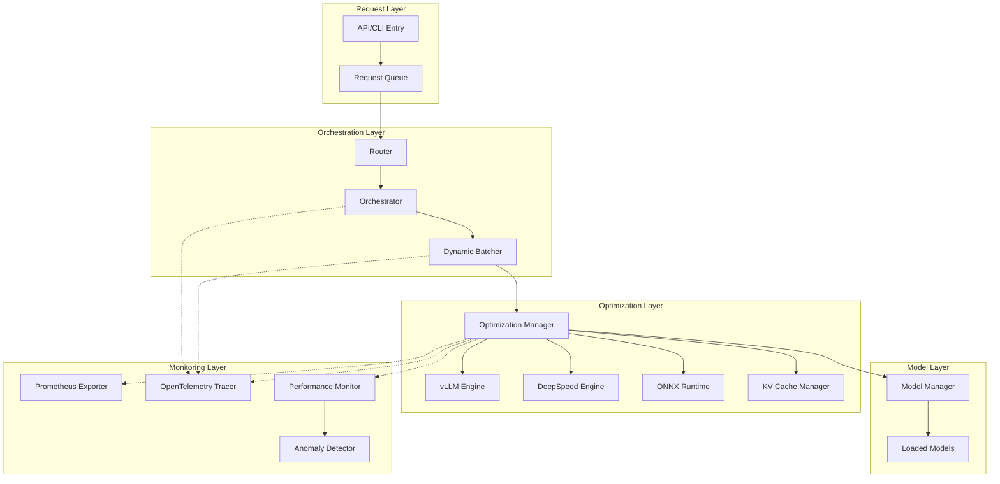

# Design Document: Advanced Optimization and Monitoring

## Overview

This design document describes the architecture and implementation approach for adding advanced optimization and monitoring capabilities to the MuAI Multi-Model Orchestration System. The feature integrates high-performance inference engines (vLLM, DeepSpeed, ONNX Runtime), production-grade monitoring (Prometheus, OpenTelemetry), and intelligent optimization strategies to enhance system performance and observability in production environments.

The design follows a modular, plugin-based architecture that maintains backward compatibility with existing code while enabling optional adoption of advanced features. All optimization engines are designed with graceful degradation, ensuring the system remains operational even when advanced features are unavailable or fail.

## Architecture

### High-Level Architecture



### Component Interaction Flow

1. **Request Ingestion**: Requests enter through API/CLI and are queued
2. **Routing**: Router classifies requests and selects appropriate workflows
3. **Batching**: Dynamic Batcher groups compatible requests
4. **Optimization**: Optimization Manager selects best inference engine
5. **Execution**: Selected engine performs inference with monitoring
6. **Monitoring**: Metrics and traces are collected throughout the pipeline

### Design Principles

1. **Optional Adoption**: All optimization features are optional and configurable
2. **Graceful Degradation**: System falls back to standard inference when optimizations fail
3. **Zero Breaking Changes**: Existing APIs and behaviors remain unchanged
4. **Performance First**: Optimizations prioritize throughput and latency improvements
5. **Observability Built-in**: Monitoring is integrated at every layer

## Components and Interfaces

### 1. Optimization Manager

**Purpose**: Coordinates inference engine selection and execution with fallback strategies.

**Interface**:
```python
class OptimizationManager:
    def __init__(self, config: OptimizationConfig):
        """Initialize with configuration for all engines."""
        
    def infer(
        self,
        model_name: str,
        inputs: Dict[str, Any],
        engine_preference: Optional[str] = None
    ) -> InferenceResult:
        """
        Execute inference with optimal engine.
        
        Args:
            model_name: Name of the model to use
            inputs: Input data for inference
            engine_preference: Optional engine hint (vllm, deepspeed, onnx, pytorch)
            
        Returns:
            InferenceResult with outputs and metadata
        """
        
    def get_available_engines(self, model_name: str) -> List[str]:
        """Return list of available engines for a model."""
        
    def get_engine_status(self) -> Dict[str, EngineStatus]:
        """Return status of all inference engines."""
```

**Responsibilities**:
- Detect available optimization engines at startup
- Select optimal engine based on model type, size, and workload
- Implement fallback chain: vLLM → DeepSpeed → ONNX → PyTorch
- Track engine performance and availability
- Coordinate with KV Cache Manager for cache-enabled inference

### 2. vLLM Engine Wrapper

**Purpose**: Integrate vLLM for high-throughput LLM inference.

**Interface**:
```python
class VLLMEngine:
    def __init__(self, config: VLLMConfig):
        """Initialize vLLM with configuration."""
        
    def load_model(
        self,
        model_name: str,
        tensor_parallel_size: int = 1,
        dtype: str = "auto"
    ) -> bool:
        """Load model into vLLM engine."""
        
    def generate(
        self,
        prompts: List[str],
        sampling_params: SamplingParams
    ) -> List[GenerationOutput]:
        """Generate text using continuous batching."""
        
    def is_available(self) -> bool:
        """Check if vLLM is available and functional."""
```

**Key Features**:
- Continuous batching for dynamic request arrival
- PagedAttention for efficient memory management
- Tensor parallelism for multi-GPU inference
- Automatic KV cache management

**Fallback Strategy**: If vLLM fails to initialize or encounters errors, fall back to DeepSpeed or PyTorch.

### 3. DeepSpeed Engine Wrapper

**Purpose**: Integrate DeepSpeed for large model inference with parallelism.

**Interface**:
```python
class DeepSpeedEngine:
    def __init__(self, config: DeepSpeedConfig):
        """Initialize DeepSpeed with configuration."""
        
    def load_model(
        self,
        model_name: str,
        tensor_parallel: int = 1,
        pipeline_parallel: int = 1
    ) -> bool:
        """Load model with DeepSpeed optimizations."""
        
    def infer(
        self,
        inputs: Dict[str, torch.Tensor]
    ) -> Dict[str, torch.Tensor]:
        """Execute inference with DeepSpeed."""
        
    def is_available(self) -> bool:
        """Check if DeepSpeed is available and functional."""
```

**Key Features**:
- Tensor parallelism for model distribution
- Model sharding across GPUs
- Inference-specific optimizations (kernel fusion, quantization)
- ZeRO-Inference for memory efficiency

**Fallback Strategy**: If DeepSpeed fails, fall back to ONNX or PyTorch.

### 4. ONNX Runtime Wrapper

**Purpose**: Integrate ONNX Runtime for cross-platform accelerated inference.

**Interface**:
```python
class ONNXEngine:
    def __init__(self, config: ONNXConfig):
        """Initialize ONNX Runtime with configuration."""
        
    def convert_model(
        self,
        model: torch.nn.Module,
        sample_inputs: Dict[str, torch.Tensor]
    ) -> str:
        """Convert PyTorch model to ONNX format."""
        
    def load_model(self, onnx_path: str) -> bool:
        """Load ONNX model into runtime."""
        
    def infer(
        self,
        inputs: Dict[str, np.ndarray]
    ) -> Dict[str, np.ndarray]:
        """Execute inference with ONNX Runtime."""
        
    def is_available(self) -> bool:
        """Check if ONNX Runtime is available."""
```

**Key Features**:
- Model conversion from PyTorch to ONNX
- Execution provider selection (CUDA, TensorRT, CPU)
- Graph optimizations
- Quantization support

**Fallback Strategy**: If ONNX conversion or inference fails, fall back to PyTorch.

### 5. Dynamic Batcher

**Purpose**: Group compatible requests for batch processing to maximize throughput.

**Interface**:
```python
class DynamicBatcher:
    def __init__(self, config: BatcherConfig):
        """Initialize batcher with configuration."""
        
    def add_request(self, request: InferenceRequest) -> str:
        """Add request to batch queue, returns request ID."""
        
    async def get_result(self, request_id: str) -> InferenceResult:
        """Wait for and retrieve result for a request."""
        
    def start(self):
        """Start background batching loop."""
        
    def stop(self):
        """Stop batching and process remaining requests."""
```

**Batching Strategy**:
- Group requests by model and compatible parameters
- Trigger batch when: size threshold reached OR timeout expires
- Adaptive batch sizing based on GPU memory and latency targets
- Padding strategy for variable-length sequences

**Configuration Parameters**:
- `max_batch_size`: Maximum requests per batch (default: 32)
- `batch_timeout_ms`: Maximum wait time for batch formation (default: 50ms)
- `adaptive_batching`: Enable dynamic batch size adjustment (default: true)

### 6. KV Cache Manager

**Purpose**: Manage key-value cache for transformer models to reduce redundant computation.

**Interface**:
```python
class KVCacheManager:
    def __init__(self, config: CacheConfig):
        """Initialize cache with memory limits."""
        
    def get_cache(
        self,
        conversation_id: str,
        model_name: str
    ) -> Optional[KVCache]:
        """Retrieve cached KV pairs for a conversation."""
        
    def store_cache(
        self,
        conversation_id: str,
        model_name: str,
        cache: KVCache
    ):
        """Store KV cache for future use."""
        
    def evict_lru(self, required_memory: int):
        """Evict least recently used caches to free memory."""
        
    def get_stats(self) -> CacheStats:
        """Return cache hit rate and memory usage statistics."""
```

**Cache Strategy**:
- LRU eviction when memory limit exceeded
- Per-conversation cache isolation
- Automatic cleanup on conversation end
- Cache hit rate tracking for monitoring

### 7. Prometheus Metrics Exporter

**Purpose**: Export performance metrics in Prometheus format.

**Interface**:
```python
class PrometheusExporter:
    def __init__(self, port: int = 9090):
        """Initialize metrics server on specified port."""
        
    def record_inference_latency(
        self,
        model_name: str,
        engine: str,
        latency_ms: float
    ):
        """Record inference latency metric."""
        
    def record_throughput(
        self,
        model_name: str,
        requests_per_second: float
    ):
        """Record throughput metric."""
        
    def record_resource_usage(
        self,
        gpu_memory_mb: float,
        cpu_percent: float
    ):
        """Record resource utilization metrics."""
        
    def start_server(self):
        """Start HTTP server for metrics endpoint."""
```

**Metrics Exposed**:
- `inference_latency_seconds{model, engine}`: Histogram of inference latencies
- `inference_requests_total{model, engine, status}`: Counter of inference requests
- `throughput_requests_per_second{model}`: Gauge of current throughput
- `gpu_memory_used_bytes{gpu_id}`: Gauge of GPU memory usage
- `cpu_usage_percent`: Gauge of CPU utilization
- `kv_cache_hit_rate{model}`: Gauge of cache hit rate
- `batch_size{model}`: Histogram of batch sizes processed

### 8. OpenTelemetry Tracer

**Purpose**: Provide distributed tracing for request flow analysis.

**Interface**:
```python
class OTelTracer:
    def __init__(self, config: TracingConfig):
        """Initialize OpenTelemetry with exporter configuration."""
        
    @contextmanager
    def trace_request(self, request_id: str) -> Span:
        """Create root span for a request."""
        
    @contextmanager
    def trace_workflow(self, workflow_name: str) -> Span:
        """Create span for workflow execution."""
        
    @contextmanager
    def trace_inference(
        self,
        model_name: str,
        engine: str
    ) -> Span:
        """Create span for model inference."""
        
    def record_error(self, span: Span, error: Exception):
        """Record error information in span."""
```

**Span Hierarchy**:
```
request (root)
├── routing
├── batching
├── workflow_execution
│   ├── preprocessing
│   ├── inference
│   │   ├── model_loading (if needed)
│   │   └── forward_pass
│   └── postprocessing
└── response_formatting
```

**Trace Attributes**:
- Request: `request_id`, `workflow_type`, `user_id`
- Inference: `model_name`, `engine`, `batch_size`, `sequence_length`
- Errors: `error_type`, `error_message`, `stack_trace`

### 9. Performance Monitor

**Purpose**: Collect and analyze detailed performance statistics.

**Interface**:
```python
class PerformanceMonitor:
    def __init__(self, config: MonitorConfig):
        """Initialize monitor with configuration."""
        
    def record_latency(
        self,
        operation: str,
        latency_ms: float,
        metadata: Dict[str, Any]
    ):
        """Record latency for an operation."""
        
    def get_percentiles(
        self,
        operation: str,
        window_seconds: int = 60
    ) -> Dict[str, float]:
        """Get p50, p95, p99 latencies for operation."""
        
    def get_throughput(
        self,
        window_seconds: int = 60
    ) -> float:
        """Calculate requests per second over time window."""
        
    def get_resource_trends(
        self,
        window_seconds: int = 300
    ) -> ResourceTrends:
        """Get resource usage trends over time."""
```

**Statistics Tracked**:
- Per-operation latency distributions
- Throughput over sliding time windows
- Resource utilization trends (GPU, CPU, memory)
- Error rates by type and component
- Cache hit rates and effectiveness

### 10. Anomaly Detector

**Purpose**: Detect performance anomalies and trigger alerts.

**Interface**:
```python
class AnomalyDetector:
    def __init__(self, config: AnomalyConfig):
        """Initialize detector with threshold configuration."""
        
    def check_latency(
        self,
        operation: str,
        latency_ms: float
    ) -> Optional[Alert]:
        """Check if latency exceeds thresholds."""
        
    def check_error_rate(
        self,
        window_seconds: int = 60
    ) -> Optional[Alert]:
        """Check if error rate exceeds thresholds."""
        
    def check_resources(
        self,
        gpu_memory_percent: float,
        cpu_percent: float
    ) -> Optional[Alert]:
        """Check if resource usage exceeds thresholds."""
        
    def send_alert(self, alert: Alert):
        """Send alert to configured destinations."""
```

**Alert Types**:
- `LatencyAlert`: Triggered when latency exceeds threshold
- `ErrorRateAlert`: Triggered when error rate exceeds threshold
- `ResourceAlert`: Triggered when resource usage exceeds threshold
- `ThroughputAlert`: Triggered when throughput drops below threshold

**Alert Destinations**:
- Structured logging (always enabled)
- Webhook notifications (configurable)
- Prometheus Alertmanager (if configured)

**Rate Limiting**: Alerts are rate-limited to prevent alert storms (max 1 alert per type per 5 minutes by default).

### 11. Inference Server

**Purpose**: Provide long-running server mode for production deployments.

**Interface**:
```python
class InferenceServer:
    def __init__(self, config: ServerConfig):
        """Initialize server with configuration."""
        
    def start(self):
        """Start server and pre-load models."""
        
    def stop(self, graceful_timeout: int = 30):
        """Stop server gracefully, completing pending requests."""
        
    def health_check(self) -> HealthStatus:
        """Return server health status."""
        
    def readiness_check(self) -> ReadinessStatus:
        """Return server readiness status."""
```

**Server Features**:
- Pre-loading of configured models at startup
- Request queue with configurable capacity
- Graceful shutdown with pending request completion
- Health and readiness endpoints for orchestration platforms
- Hot-reload of configuration (non-critical parameters)

**Health Check Response**:
```json
{
  "status": "healthy",
  "uptime_seconds": 3600,
  "models_loaded": ["qwen-chat", "t5-small"],
  "engines_available": ["vllm", "pytorch"],
  "queue_size": 5,
  "queue_capacity": 100
}
```

### 12. Auto-Tuner

**Purpose**: Automatically adjust performance parameters based on workload.

**Interface**:
```python
class AutoTuner:
    def __init__(self, config: TunerConfig):
        """Initialize tuner with configuration."""
        
    def analyze_performance(
        self,
        metrics: PerformanceMetrics
    ) -> TuningRecommendations:
        """Analyze metrics and recommend parameter adjustments."""
        
    def apply_tuning(
        self,
        recommendations: TuningRecommendations
    ):
        """Apply tuning recommendations to system."""
        
    def get_tuning_history(self) -> List[TuningEvent]:
        """Return history of tuning decisions."""
```

**Tunable Parameters**:
- Batch size (based on latency and throughput targets)
- Batch timeout (based on request arrival patterns)
- Cache size (based on hit rate and memory availability)
- Model quantization level (based on accuracy vs. speed tradeoff)

**Tuning Strategy**:
- Collect performance data over observation window (default: 5 minutes)
- Detect performance patterns (high latency, low throughput, etc.)
- Generate recommendations using heuristics and historical data
- Apply changes gradually with rollback on degradation
- Log all tuning decisions for transparency

## Data Models

### Configuration Models

```python
@dataclass
class OptimizationConfig:
    """Configuration for optimization features."""
    vllm_enabled: bool = True
    deepspeed_enabled: bool = True
    onnx_enabled: bool = True
    engine_preference: List[str] = field(default_factory=lambda: ["vllm", "deepspeed", "onnx", "pytorch"])
    fallback_on_error: bool = True

@dataclass
class VLLMConfig:
    """Configuration for vLLM engine."""
    tensor_parallel_size: int = 1
    dtype: str = "auto"
    max_model_len: Optional[int] = None
    gpu_memory_utilization: float = 0.9
    swap_space: int = 4  # GB

@dataclass
class DeepSpeedConfig:
    """Configuration for DeepSpeed engine."""
    tensor_parallel: int = 1
    pipeline_parallel: int = 1
    dtype: str = "fp16"
    replace_with_kernel_inject: bool = True

@dataclass
class ONNXConfig:
    """Configuration for ONNX Runtime."""
    execution_providers: List[str] = field(default_factory=lambda: ["CUDAExecutionProvider", "CPUExecutionProvider"])
    optimization_level: str = "all"
    enable_quantization: bool = False

@dataclass
class BatcherConfig:
    """Configuration for dynamic batching."""
    max_batch_size: int = 32
    batch_timeout_ms: int = 50
    adaptive_batching: bool = True
    min_batch_size: int = 1

@dataclass
class CacheConfig:
    """Configuration for KV cache."""
    max_memory_mb: int = 4096
    eviction_policy: str = "lru"
    enable_cache: bool = True

@dataclass
class MonitoringConfig:
    """Configuration for monitoring."""
    prometheus_port: int = 9090
    prometheus_enabled: bool = True
    tracing_enabled: bool = True
    tracing_endpoint: str = "http://localhost:4317"
    tracing_sample_rate: float = 1.0

@dataclass
class AnomalyConfig:
    """Configuration for anomaly detection."""
    latency_threshold_ms: float = 1000.0
    error_rate_threshold: float = 0.05
    memory_threshold_percent: float = 90.0
    throughput_threshold_rps: float = 1.0
    alert_rate_limit_seconds: int = 300

@dataclass
class ServerConfig:
    """Configuration for inference server."""
    host: str = "0.0.0.0"
    port: int = 8000
    queue_capacity: int = 100
    preload_models: List[str] = field(default_factory=list)
    graceful_shutdown_timeout: int = 30
```

### Runtime Models

```python
@dataclass
class InferenceResult:
    """Result from inference execution."""
    outputs: Dict[str, Any]
    engine_used: str
    latency_ms: float
    batch_size: int
    cache_hit: bool
    metadata: Dict[str, Any]

@dataclass
class EngineStatus:
    """Status of an inference engine."""
    name: str
    available: bool
    models_loaded: List[str]
    error_message: Optional[str]
    last_check: datetime

@dataclass
class CacheStats:
    """Statistics for KV cache."""
    total_entries: int
    memory_used_mb: float
    hit_rate: float
    evictions: int

@dataclass
class Alert:
    """Alert for anomaly detection."""
    alert_type: str
    severity: str  # "warning", "error", "critical"
    message: str
    timestamp: datetime
    metadata: Dict[str, Any]

@dataclass
class HealthStatus:
    """Health status for server."""
    status: str  # "healthy", "degraded", "unhealthy"
    uptime_seconds: float
    models_loaded: List[str]
    engines_available: List[str]
    queue_size: int
    queue_capacity: int

@dataclass
class TuningRecommendations:
    """Recommendations from auto-tuner."""
    batch_size: Optional[int]
    batch_timeout_ms: Optional[int]
    cache_size_mb: Optional[int]
    rationale: str
```

## Correctness Properties

*A property is a characteristic or behavior that should hold true across all valid executions of a system—essentially, a formal statement about what the system should do. Properties serve as the bridge between human-readable specifications and machine-verifiable correctness guarantees.*

### Engine Selection and Fallback Properties

Property 1: Engine selection respects availability and preference
*For any* model and inference request, when an engine is available and preferred, the system should use that engine for inference.
**Validates: Requirements 1.1, 2.1, 3.1**

Property 2: Fallback chain is followed on engine failure
*For any* inference request, when the preferred engine fails or is unavailable, the system should attempt the next engine in the fallback chain (vLLM → DeepSpeed → ONNX → PyTorch).
**Validates: Requirements 1.4, 1.6, 2.4, 2.5, 3.4, 3.5, 15.1, 15.2, 15.3**

Property 3: Engine configuration is applied correctly
*For any* model loaded with an optimization engine, the engine should be configured with the specified parallelism and dtype settings from configuration.
**Validates: Requirements 1.5, 2.2, 2.3, 3.3**

Property 4: ONNX conversion preserves model behavior
*For any* PyTorch model converted to ONNX, inference on the same inputs should produce equivalent outputs (within numerical tolerance) for both the original and converted models.
**Validates: Requirements 3.2**

### Batching Properties

Property 5: Compatible requests are batched together
*For any* set of inference requests for the same model arriving within the batch timeout window, they should be grouped into a single batch for processing.
**Validates: Requirements 6.1**

Property 6: Batch processing is triggered by size or timeout
*For any* batch of requests, processing should be triggered when either the batch size reaches the maximum threshold OR the timeout expires, whichever comes first.
**Validates: Requirements 6.2, 6.3**

Property 7: Batch size adapts to system load
*For any* period of changing system load, the dynamic batcher should adjust batch sizes to maintain target latency and throughput.
**Validates: Requirements 6.4**

Property 8: Variable-length sequences are padded correctly
*For any* batch containing requests with different sequence lengths, padding should be applied such that all sequences have the same length for batch processing.
**Validates: Requirements 6.5**

Property 9: Batching can be disabled
*For any* inference request when batching is disabled, the request should be processed individually without waiting for other requests.
**Validates: Requirements 6.6**

### KV Cache Properties

Property 10: Cache is enabled for compatible models
*For any* model that supports KV caching, the system should enable and utilize KV cache for inference operations.
**Validates: Requirements 7.1**

Property 11: Multi-turn conversations reuse cache
*For any* multi-turn conversation, subsequent turns should reuse cached key-value pairs from previous turns, resulting in cache hits.
**Validates: Requirements 7.2**

Property 12: LRU eviction occurs on memory overflow
*For any* cache state where adding new entries would exceed memory limits, the least recently used entries should be evicted to make space.
**Validates: Requirements 7.3**

Property 13: Cache is released on conversation end
*For any* conversation that ends, the associated cache memory should be released and available for other conversations.
**Validates: Requirements 7.4**

Property 14: Cache hit rates are tracked
*For any* cache operations, hit rate statistics should be collected and available for monitoring queries.
**Validates: Requirements 7.5**

### Monitoring and Metrics Properties

Property 15: Inference metrics are recorded
*For any* completed inference operation, latency and throughput metrics should be recorded in the metrics exporter.
**Validates: Requirements 4.2, 4.3**

Property 16: Model lifecycle events are recorded
*For any* model load or unload operation, a lifecycle event should be recorded in the metrics exporter.
**Validates: Requirements 4.4**

Property 17: Resource metrics are continuously recorded
*For any* monitoring period, GPU memory and CPU usage metrics should be periodically recorded.
**Validates: Requirements 4.5, 4.6**

Property 18: Metrics are exposed in Prometheus format
*For any* metrics endpoint query, the response should be in valid Prometheus text format with proper metric types and labels.
**Validates: Requirements 4.7**

### Tracing Properties

Property 19: Root span is created for each request
*For any* request entering the system, a root span should be created with a unique trace ID.
**Validates: Requirements 5.1**

Property 20: Child spans are created for workflow steps
*For any* workflow execution with multiple steps, child spans should be created for each step under the workflow span.
**Validates: Requirements 5.2**

Property 21: Inference spans include model metadata
*For any* model inference operation, the corresponding span should include model name, engine type, and batch size as attributes.
**Validates: Requirements 5.3**

Property 22: Span duration and status are recorded
*For any* completed span, the duration and final status (success/error) should be recorded.
**Validates: Requirements 5.4**

Property 23: Errors are recorded in spans
*For any* error occurring during a traced operation, error type, message, and stack trace should be recorded in the span.
**Validates: Requirements 5.5**

Property 24: Trace context is propagated
*For any* operation spanning multiple components, trace context should be propagated such that all spans share the same trace ID.
**Validates: Requirements 5.6**

### Server Mode Properties

Property 25: Models remain loaded in server mode
*For any* model pre-loaded in server mode, it should remain in memory across multiple requests without reloading.
**Validates: Requirements 8.1**

Property 26: Requests are queued in server mode
*For any* incoming request in server mode, it should be added to the request queue for processing.
**Validates: Requirements 8.2**

Property 27: Full queue rejects new requests
*For any* incoming request when the queue is at capacity, the request should be rejected with an appropriate error code.
**Validates: Requirements 8.3**

Property 28: Graceful shutdown completes pending requests
*For any* shutdown signal with pending requests in the queue, all pending requests should be completed before the server terminates.
**Validates: Requirements 8.5**

### Performance Monitoring Properties

Property 29: Per-request latency is collected
*For any* request processed by the system, latency should be recorded in the performance monitor.
**Validates: Requirements 9.1**

Property 30: Per-model inference time is collected
*For any* model inference operation, inference time should be recorded with model identification.
**Validates: Requirements 9.2**

Property 31: Throughput is calculated over time windows
*For any* time window query, throughput (requests per second) should be calculable from recorded request timestamps.
**Validates: Requirements 9.3**

Property 32: Resource utilization is tracked
*For any* monitoring period, GPU, CPU, and memory utilization should be tracked and queryable.
**Validates: Requirements 9.4**

Property 33: Percentile latencies are computable
*For any* set of latency measurements, p50, p95, and p99 percentiles should be computable.
**Validates: Requirements 9.5**

### Anomaly Detection Properties

Property 34: Latency threshold triggers alerts
*For any* operation with latency exceeding the configured threshold, a latency alert should be triggered.
**Validates: Requirements 10.1**

Property 35: Error rate threshold triggers alerts
*For any* time window where error rate exceeds the configured threshold, an error rate alert should be triggered.
**Validates: Requirements 10.2**

Property 36: Memory threshold triggers alerts
*For any* measurement where memory usage exceeds the configured threshold, a memory alert should be triggered.
**Validates: Requirements 10.3**

Property 37: Throughput threshold triggers alerts
*For any* time window where throughput drops below the configured threshold, a throughput alert should be triggered.
**Validates: Requirements 10.4**

Property 38: Alerts are sent to configured destinations
*For any* triggered alert, it should be sent to all configured alert destinations (logs, webhooks, Alertmanager).
**Validates: Requirements 10.5**

Property 39: Alert rate limiting prevents storms
*For any* rapid sequence of similar alerts, only one alert per type should be sent within the rate limit window.
**Validates: Requirements 10.6**

### Multi-GPU Properties

Property 40: Tensor parallelism is supported on multi-GPU
*For any* multi-GPU system, tensor parallelism should be available for distributing model layers across GPUs.
**Validates: Requirements 11.1**

Property 41: Pipeline parallelism is supported on multi-GPU
*For any* multi-GPU system, pipeline parallelism should be available for distributing model stages across GPUs.
**Validates: Requirements 11.2**

Property 42: Load is balanced across GPUs
*For any* model distributed across multiple GPUs, computational load should be balanced to maximize utilization.
**Validates: Requirements 11.3**

Property 43: GPU failures are detected
*For any* GPU failure during inference, the failure should be detected and logged.
**Validates: Requirements 11.4**

Property 44: Per-GPU metrics are exposed
*For any* GPU in the system, individual metrics (memory, utilization) should be exposed for monitoring.
**Validates: Requirements 11.5**

### Auto-Tuning Properties

Property 45: Batch size adapts to load changes
*For any* significant change in system load, the auto-tuner should adjust batch size to maintain performance targets.
**Validates: Requirements 12.1**

Property 46: Timeout parameters adapt to load changes
*For any* significant change in request arrival patterns, the auto-tuner should adjust timeout parameters.
**Validates: Requirements 12.2**

Property 47: Cache size adapts to usage patterns
*For any* significant change in cache hit rates or memory pressure, the auto-tuner should adjust cache size.
**Validates: Requirements 12.3**

Property 48: Tuning decisions are logged
*For any* tuning decision made by the auto-tuner, the decision and rationale should be logged and exposed in metrics.
**Validates: Requirements 12.5**

Property 49: Static configuration is used when auto-tuning is disabled
*For any* operation when auto-tuning is disabled, static configuration parameters should be used without adaptation.
**Validates: Requirements 12.6**

### Backward Compatibility Properties

Property 50: System functions without optimization features
*For any* operation when all optimization features are disabled, the system should function with the same behavior as the original implementation.
**Validates: Requirements 13.1**

Property 51: Missing libraries trigger fallback
*For any* optimization library that is not installed, the system should detect its absence and fall back to standard inference.
**Validates: Requirements 13.2**

Property 52: Features are configuration-controlled
*For any* optimization feature, it should be possible to enable or disable it through configuration.
**Validates: Requirements 13.3**

Property 53: Existing APIs remain unchanged
*For any* existing API call to Model_Manager or Workflow components, the call should succeed with the same interface and behavior.
**Validates: Requirements 13.4**

### Configuration Properties

Property 54: YAML configuration is parsed correctly
*For any* valid YAML configuration file, the system should parse it and apply the settings correctly.
**Validates: Requirements 14.1**

Property 55: Environment variables override configuration
*For any* configuration parameter with both file and environment variable values, the environment variable value should take precedence.
**Validates: Requirements 14.2**

Property 56: Invalid configuration is rejected with clear errors
*For any* invalid configuration (missing required fields, invalid values), the system should reject it at startup with a clear error message.
**Validates: Requirements 14.3**

Property 57: Default values are used for missing configuration
*For any* configuration parameter not specified in the configuration file, the system should use the documented default value.
**Validates: Requirements 14.4**

Property 58: Non-critical parameters support runtime updates
*For any* non-critical configuration parameter, it should be possible to update it at runtime without restarting the system.
**Validates: Requirements 14.5**

### Graceful Degradation Properties

Property 59: Monitoring failures don't block requests
*For any* metrics export or tracing failure, the system should log the error but continue processing inference requests.
**Validates: Requirements 15.4, 15.5**

Property 60: Health checks reflect degradation status
*For any* degraded state (e.g., optimization engine unavailable), the health check endpoint should reflect the degradation in its response.
**Validates: Requirements 15.6**


## Error Handling

### Error Categories

1. **Engine Initialization Errors**: Failures when loading vLLM, DeepSpeed, or ONNX Runtime
2. **Inference Errors**: Failures during model inference execution
3. **Configuration Errors**: Invalid or missing configuration parameters
4. **Resource Errors**: Out of memory, GPU failures, disk space issues
5. **Monitoring Errors**: Failures in metrics export or tracing
6. **Network Errors**: Failures connecting to external monitoring services

### Error Handling Strategy

**Fallback Chain for Engine Errors**:
```python
try:
    result = vllm_engine.infer(inputs)
except VLLMError as e:
    logger.warning(f"vLLM failed: {e}, falling back to DeepSpeed")
    try:
        result = deepspeed_engine.infer(inputs)
    except DeepSpeedError as e:
        logger.warning(f"DeepSpeed failed: {e}, falling back to ONNX")
        try:
            result = onnx_engine.infer(inputs)
        except ONNXError as e:
            logger.warning(f"ONNX failed: {e}, falling back to PyTorch")
            result = pytorch_engine.infer(inputs)
```

**Monitoring Failure Handling**:
- Metrics export failures: Log error, continue processing, expose degradation in health check
- Tracing failures: Log error, continue processing, disable tracing for subsequent requests
- Alert delivery failures: Log error, retry with exponential backoff, mark alert as failed

**Resource Error Handling**:
- OOM errors: Reduce batch size, evict caches, retry with smaller batch
- GPU failures: Detect failed GPU, redistribute load to healthy GPUs, update health status
- Disk space errors: Clean up old traces/logs, alert operators, continue with reduced logging

**Configuration Error Handling**:
- Invalid values: Reject configuration at startup with clear error message
- Missing required fields: Use defaults if available, otherwise fail fast
- Type mismatches: Validate types and provide helpful error messages

### Error Logging

All errors should be logged with structured context:
```python
logger.error(
    "Inference failed",
    extra={
        "error_type": type(e).__name__,
        "model_name": model_name,
        "engine": engine_name,
        "request_id": request_id,
        "stack_trace": traceback.format_exc()
    }
)
```

### Health Status Degradation

The system maintains three health states:
- **Healthy**: All engines available, monitoring functional
- **Degraded**: Some engines unavailable but system operational
- **Unhealthy**: Critical failures preventing request processing

Health checks expose current state and degradation reasons.

## Testing Strategy

### Dual Testing Approach

The testing strategy employs both unit tests and property-based tests for comprehensive coverage:

**Unit Tests**: Focus on specific examples, edge cases, and integration points
- Specific configuration scenarios
- Error handling paths
- Integration between components
- Edge cases (empty batches, single requests, etc.)

**Property-Based Tests**: Verify universal properties across all inputs
- Engine selection logic across random configurations
- Batching behavior with random request patterns
- Cache eviction with random access patterns
- Metrics recording for random operations
- Configuration parsing with random valid/invalid inputs

### Property-Based Testing Configuration

**Library**: Hypothesis (Python property-based testing library)

**Test Configuration**:
- Minimum 100 iterations per property test
- Each test references its design document property
- Tag format: `# Feature: advanced-optimization-monitoring, Property N: [property text]`

**Example Property Test**:
```python
from hypothesis import given, strategies as st
import pytest

# Feature: advanced-optimization-monitoring, Property 2: Fallback chain is followed on engine failure
@given(
    model_name=st.text(min_size=1),
    engine_failures=st.lists(st.sampled_from(["vllm", "deepspeed", "onnx"]), max_size=3)
)
@pytest.mark.property
def test_fallback_chain_on_failure(model_name, engine_failures):
    """
    Property: For any inference request, when the preferred engine fails,
    the system should attempt the next engine in the fallback chain.
    """
    # Setup: Configure engines with simulated failures
    config = OptimizationConfig(
        vllm_enabled="vllm" not in engine_failures,
        deepspeed_enabled="deepspeed" not in engine_failures,
        onnx_enabled="onnx" not in engine_failures
    )
    manager = OptimizationManager(config)
    
    # Execute: Attempt inference
    result = manager.infer(model_name, {"input": "test"})
    
    # Verify: Engine used should be first available in fallback chain
    expected_engines = ["vllm", "deepspeed", "onnx", "pytorch"]
    available_engines = [e for e in expected_engines if e not in engine_failures]
    assert result.engine_used == available_engines[0]
```

### Test Organization

**Unit Tests** (`tests/unit/`):
- `test_optimization_manager.py`: Engine selection, fallback logic
- `test_vllm_engine.py`: vLLM integration and configuration
- `test_deepspeed_engine.py`: DeepSpeed integration and configuration
- `test_onnx_engine.py`: ONNX conversion and inference
- `test_dynamic_batcher.py`: Batching logic and timeout handling
- `test_kv_cache_manager.py`: Cache operations and eviction
- `test_prometheus_exporter.py`: Metrics recording and formatting
- `test_otel_tracer.py`: Span creation and context propagation
- `test_performance_monitor.py`: Statistics collection and queries
- `test_anomaly_detector.py`: Threshold checking and alerting
- `test_inference_server.py`: Server lifecycle and health checks
- `test_auto_tuner.py`: Parameter tuning logic

**Property Tests** (`tests/property/`):
- `test_engine_selection_properties.py`: Properties 1-4
- `test_batching_properties.py`: Properties 5-9
- `test_cache_properties.py`: Properties 10-14
- `test_monitoring_properties.py`: Properties 15-24
- `test_server_properties.py`: Properties 25-28
- `test_performance_properties.py`: Properties 29-33
- `test_anomaly_properties.py`: Properties 34-39
- `test_multi_gpu_properties.py`: Properties 40-44
- `test_tuning_properties.py`: Properties 45-49
- `test_compatibility_properties.py`: Properties 50-53
- `test_configuration_properties.py`: Properties 54-58
- `test_degradation_properties.py`: Properties 59-60

**Integration Tests** (`tests/integration/`):
- `test_end_to_end_optimization.py`: Full request flow with optimizations
- `test_monitoring_integration.py`: Metrics and tracing in real workflows
- `test_server_mode_integration.py`: Server lifecycle with real models
- `test_multi_engine_fallback.py`: Fallback behavior across engines

### Test Fixtures

**Model Fixtures** (`tests/fixtures/models.py`):
- Mock models for each engine type
- Sample inputs and expected outputs
- Configuration templates

**Monitoring Fixtures** (`tests/fixtures/monitoring.py`):
- Mock Prometheus exporters
- Mock OpenTelemetry collectors
- Sample metrics and traces

**Configuration Fixtures** (`tests/fixtures/configs.py`):
- Valid configuration examples
- Invalid configuration examples for error testing
- Environment variable overrides

### Performance Benchmarks

In addition to correctness tests, performance benchmarks should be run to validate optimization effectiveness:

**Benchmark Metrics**:
- Throughput (requests/second) with and without optimizations
- Latency percentiles (p50, p95, p99) with and without optimizations
- Memory usage with different batch sizes
- Cache hit rates in multi-turn conversations
- GPU utilization with different parallelism settings

**Benchmark Suite** (`tests/benchmarks/`):
- `benchmark_vllm_throughput.py`: vLLM vs PyTorch throughput
- `benchmark_batching_latency.py`: Batching impact on latency
- `benchmark_cache_effectiveness.py`: Cache hit rates and speedup
- `benchmark_multi_gpu_scaling.py`: Scaling efficiency with multiple GPUs

## Integration with Existing System

### Integration Points

**1. Model Manager Integration**:
- OptimizationManager wraps existing ModelManager
- Existing model loading logic remains unchanged
- Optimization engines are optional layer on top

```python
# Existing code continues to work
model_manager = ModelManager(config)
model = model_manager.load_model("qwen-chat")

# New optimized path (optional)
opt_manager = OptimizationManager(opt_config, model_manager)
result = opt_manager.infer("qwen-chat", inputs)
```

**2. Workflow Integration**:
- Workflows can optionally use OptimizationManager
- Fallback to direct ModelManager if optimizations disabled
- No changes required to existing workflow implementations

```python
class SearchQAWorkflow(BaseWorkflow):
    def __init__(self, model_manager, opt_manager=None):
        self.model_manager = model_manager
        self.opt_manager = opt_manager  # Optional
        
    def execute(self, parameters):
        if self.opt_manager:
            result = self.opt_manager.infer(model_name, inputs)
        else:
            result = self.model_manager.infer(model_name, inputs)
```

**3. Orchestrator Integration**:
- Orchestrator initializes monitoring components
- Traces are created for each workflow execution
- Metrics are recorded for all operations

```python
class Orchestrator:
    def __init__(self, config):
        # Existing initialization
        self.router = Router(config)
        self.workflows = self._init_workflows()
        
        # New monitoring (optional)
        if config.monitoring_enabled:
            self.tracer = OTelTracer(config.tracing)
            self.metrics = PrometheusExporter(config.prometheus)
            
    def execute_workflow(self, request):
        with self.tracer.trace_request(request.id):
            # Existing workflow execution
            result = workflow.execute(request.parameters)
            
            # Record metrics
            self.metrics.record_latency(workflow.name, result.latency)
        return result
```

**4. Configuration Integration**:
- New optimization section in `config/system.yaml`
- Backward compatible: missing section means optimizations disabled
- Environment variables follow existing patterns

```yaml
# Existing configuration
models:
  cache_dir: "./models"
  max_cached: 3

# New optimization configuration (optional)
optimization:
  enabled: true
  vllm:
    enabled: true
    tensor_parallel_size: 2
  deepspeed:
    enabled: false
  onnx:
    enabled: true
    
monitoring:
  prometheus:
    enabled: true
    port: 9090
  tracing:
    enabled: true
    endpoint: "http://localhost:4317"
```

### Migration Path

**Phase 1: Monitoring Only**
- Deploy Prometheus exporter and OpenTelemetry tracer
- No changes to inference engines
- Gain observability without risk

**Phase 2: Single Engine**
- Enable one optimization engine (e.g., vLLM)
- Test thoroughly in staging
- Rollback capability via configuration

**Phase 3: Full Optimization**
- Enable all optimization engines
- Enable dynamic batching and KV cache
- Enable auto-tuning

**Phase 4: Production Hardening**
- Fine-tune thresholds and parameters
- Set up alerting and dashboards
- Document operational procedures

### Deployment Considerations

**Dependencies**:
- Optional dependencies in `requirements.txt`:
  ```
  # Optimization engines (optional)
  vllm>=0.2.0  # [optimization]
  deepspeed>=0.10.0  # [optimization]
  onnxruntime-gpu>=1.16.0  # [optimization]
  
  # Monitoring (optional)
  prometheus-client>=0.18.0  # [monitoring]
  opentelemetry-api>=1.20.0  # [monitoring]
  opentelemetry-sdk>=1.20.0  # [monitoring]
  ```

**Installation**:
```bash
# Minimal installation (no optimizations)
pip install -e .

# With optimizations
pip install -e ".[optimization]"

# With monitoring
pip install -e ".[monitoring]"

# Full installation
pip install -e ".[optimization,monitoring]"
```

**Docker Deployment**:
- Multi-stage build for different configurations
- Base image with core functionality
- Extended images with optimization libraries

**Kubernetes Deployment**:
- Health and readiness probes use server endpoints
- Prometheus metrics scraped via annotations
- OpenTelemetry traces sent to collector sidecar
- Horizontal pod autoscaling based on queue size

## Performance Expectations

### Expected Improvements

**vLLM Integration**:
- 2-5x throughput improvement for LLM inference
- 30-50% reduction in latency for batched requests
- 40-60% reduction in GPU memory usage (PagedAttention)

**DeepSpeed Integration**:
- Enable serving of models too large for single GPU
- Near-linear scaling with tensor parallelism (up to 4 GPUs)
- 20-30% speedup from kernel optimizations

**ONNX Runtime**:
- 1.5-2x speedup for smaller models
- Better CPU inference performance
- Cross-platform deployment flexibility

**Dynamic Batching**:
- 3-10x throughput improvement (depends on request rate)
- Minimal latency increase (<50ms) with proper timeout tuning
- Better GPU utilization (70-90% vs 20-40%)

**KV Cache**:
- 2-3x speedup for multi-turn conversations
- Reduced memory bandwidth usage
- Lower latency for subsequent turns

### Resource Requirements

**Minimum Requirements** (monitoring only):
- CPU: 4 cores
- RAM: 8GB
- GPU: Not required
- Disk: 10GB for logs and traces

**Recommended Requirements** (with optimizations):
- CPU: 8+ cores
- RAM: 32GB+
- GPU: NVIDIA T4 (16GB) or better
- Disk: 50GB for models, logs, and traces

**Production Requirements** (full deployment):
- CPU: 16+ cores
- RAM: 64GB+
- GPU: NVIDIA A100 (40GB) or multiple T4s
- Disk: 100GB+ SSD for fast model loading
- Network: 10Gbps for distributed tracing

## Future Enhancements

### Potential Extensions

1. **Additional Inference Engines**:
   - TensorRT integration for NVIDIA GPUs
   - OpenVINO for Intel hardware
   - Apple Neural Engine for M-series chips

2. **Advanced Batching**:
   - Priority-based batching (latency-sensitive vs throughput-optimized)
   - Multi-model batching (batch requests across different models)
   - Speculative batching (predict future requests)

3. **Enhanced Monitoring**:
   - Grafana dashboard templates
   - Anomaly detection with ML models
   - Cost tracking and optimization recommendations

4. **Auto-Scaling**:
   - Automatic model replication based on load
   - Dynamic resource allocation
   - Predictive scaling based on historical patterns

5. **Advanced Caching**:
   - Semantic caching (cache similar prompts)
   - Distributed cache across multiple servers
   - Cache warming based on predicted queries

6. **Multi-Tenant Support**:
   - Per-tenant resource quotas
   - Isolated metrics and tracing
   - Fair scheduling across tenants

These enhancements can be added incrementally without breaking existing functionality, following the same modular design principles.
