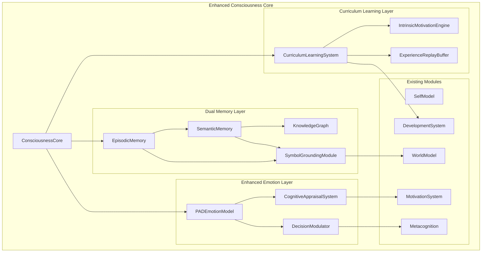

# Design Document: Consciousness System Deepening

## Overview

This design document describes the architecture and implementation approach for deepening the MuAI consciousness system. The enhancement introduces three major subsystems that build upon the existing consciousness modules:

1. **Curriculum Learning System** - Manages progressive developmental training with automatic difficulty adjustment, intrinsic motivation, and continuous learning mechanisms.

2. **Dual Memory System** - Implements episodic memory for specific experiences and semantic memory with a knowledge graph, connected through symbol grounding.

3. **Enhanced Emotion System** - Upgrades the existing emotion module to use the PAD (Pleasure-Arousal-Dominance) model with cognitive appraisal and decision modulation.

These enhancements follow the hybrid architecture approach recommended in the research report, combining neural network learning with symbolic reasoning capabilities.

## Architecture

The enhanced consciousness system follows a layered architecture that integrates with the existing `ConsciousnessCore`:



### Information Flow

1. **Event Processing Flow**:
   - Events enter through `ConsciousnessCore.update_state()`
   - Events are routed to `CognitiveAppraisalSystem` for emotional evaluation
   - Appraisal results update `PADEmotionModel`
   - Significant events create episodes in `EpisodicMemory`
   - `DecisionModulator` adjusts strategy parameters based on emotional state

2. **Learning Flow**:
   - Task results feed into `CurriculumLearningSystem` for difficulty adjustment
   - `IntrinsicMotivationEngine` calculates curiosity rewards
   - Experiences are stored in `ExperienceReplayBuffer`
   - Periodic consolidation transfers patterns from `EpisodicMemory` to `SemanticMemory`

3. **Memory Retrieval Flow**:
   - Queries first check `SemanticMemory` for general knowledge
   - Context-specific retrieval uses `EpisodicMemory`
   - `SymbolGroundingModule` resolves symbol references to grounded meanings

## Components and Interfaces

### 1. CurriculumLearningSystem

Manages progressive developmental training with automatic difficulty adjustment.

```python
class CurriculumLearningSystem:
    """Manages curriculum-based developmental training."""
    
    def __init__(self, development_system: DevelopmentSystem, config: Optional[Dict] = None):
        """Initialize with reference to existing development system."""
        
    def estimate_task_difficulty(self, task: Task) -> TaskDifficulty:
        """
        Estimate difficulty of a task across multiple dimensions.
        
        Returns:
            TaskDifficulty with scores for complexity, required_capabilities,
            cognitive_load, and overall_difficulty (0.0 to 1.0).
        """
        
    def get_capability_level(self, dimension: str) -> float:
        """Get current capability level for a dimension (0.0 to 1.0)."""
        
    def is_in_zpd(self, task: Task) -> ZPDAssessment:
        """
        Check if task is in Zone of Proximal Development.
        
        Returns:
            ZPDAssessment with in_zpd boolean, difficulty_gap, and recommendations.
        """
        
    def update_capabilities(self, task_type: str, success: bool, score: float) -> Dict[str, float]:
        """Update capability estimates after task completion."""
        
    def get_recommended_difficulty(self, capability_dimension: str) -> float:
        """Get recommended task difficulty for optimal learning."""
        
    def suggest_scaffolding(self, task: Task) -> List[Task]:
        """Suggest decomposed sub-tasks for a too-difficult task."""
```

### 2. IntrinsicMotivationEngine

Generates curiosity-driven exploration rewards.

```python
class IntrinsicMotivationEngine:
    """Manages intrinsic motivation and curiosity-driven exploration."""
    
    def __init__(self, config: Optional[Dict] = None):
        """Initialize the intrinsic motivation engine."""
        
    def calculate_curiosity_reward(self, 
                                   predicted_outcome: Any, 
                                   actual_outcome: Any) -> float:
        """
        Calculate curiosity reward based on prediction error.
        
        Returns:
            Reward value (0.0 to 1.0) proportional to information gain.
        """
        
    def get_novelty_score(self, stimulus: Any) -> float:
        """Get novelty score for a stimulus (0.0 familiar to 1.0 novel)."""
        
    def update_familiarity(self, stimulus: Any) -> None:
        """Update familiarity tracking for a stimulus."""
        
    def get_exploration_bonus(self, action: str, context: Dict) -> float:
        """Get exploration bonus for an action in context."""
        
    def decay_curiosity(self, stimulus: Any) -> None:
        """Apply curiosity decay for repeated stimulus."""
```

### 3. ExperienceReplayBuffer

Stores experiences for continuous learning without catastrophic forgetting.

```python
class ExperienceReplayBuffer:
    """Manages experience storage and replay for continuous learning."""
    
    def __init__(self, max_size: int = 10000, config: Optional[Dict] = None):
        """Initialize the experience replay buffer."""
        
    def store(self, experience: Experience) -> str:
        """Store an experience and return its ID."""
        
    def sample(self, batch_size: int, strategy: str = "prioritized") -> List[Experience]:
        """
        Sample experiences for replay.
        
        Args:
            batch_size: Number of experiences to sample.
            strategy: "uniform", "prioritized", or "stratified".
        """
        
    def update_priority(self, experience_id: str, priority: float) -> None:
        """Update priority of an experience."""
        
    def get_task_type_distribution(self) -> Dict[str, int]:
        """Get distribution of experiences by task type."""
        
    def prune(self) -> int:
        """Remove low-priority experiences to maintain size limit."""
```

### 4. EpisodicMemory

Stores specific experiences as discrete episodes.

```python
@dataclass
class Episode:
    """Represents a discrete episode in memory."""
    episode_id: str
    timestamp: float
    context: Dict[str, Any]
    actions: List[Dict[str, Any]]
    outcomes: Dict[str, Any]
    emotional_state: Dict[str, float]  # PAD values at time of episode
    relevance_tags: List[str]
    importance_score: float
    access_count: int = 0
    last_accessed: Optional[float] = None
    embedding: Optional[List[float]] = None


class EpisodicMemory:
    """Manages episodic memory storage and retrieval."""
    
    def __init__(self, max_episodes: int = 5000, config: Optional[Dict] = None):
        """Initialize episodic memory."""
        
    def create_episode(self, 
                       context: Dict[str, Any],
                       actions: List[Dict[str, Any]],
                       outcomes: Dict[str, Any],
                       emotional_state: Dict[str, float],
                       relevance_tags: Optional[List[str]] = None) -> Episode:
        """Create and store a new episode."""
        
    def retrieve_by_similarity(self, 
                               query_context: Dict[str, Any], 
                               top_k: int = 5) -> List[Episode]:
        """Retrieve episodes by contextual similarity."""
        
    def retrieve_by_time(self, 
                         start_time: float, 
                         end_time: float) -> List[Episode]:
        """Retrieve episodes within a time range."""
        
    def retrieve_by_emotion(self, 
                            target_pad: Dict[str, float], 
                            threshold: float = 0.3) -> List[Episode]:
        """Retrieve episodes with similar emotional states."""
        
    def consolidate(self) -> ConsolidationResult:
        """
        Consolidate episodes by extracting patterns for semantic memory.
        
        Returns:
            ConsolidationResult with extracted_patterns and updated_episodes.
        """
        
    def decay_and_prune(self) -> int:
        """Apply decay and remove low-importance episodes."""
```

### 5. SemanticMemory and KnowledgeGraph

Stores general knowledge with concept relationships.

```python
@dataclass
class ConceptNode:
    """Represents a concept in the knowledge graph."""
    concept_id: str
    name: str
    concept_type: str  # entity, attribute, action, relation
    attributes: Dict[str, Any]
    confidence: float
    frequency: int
    created_at: float
    updated_at: float


@dataclass  
class Relationship:
    """Represents a relationship between concepts."""
    relation_id: str
    source_id: str
    target_id: str
    relation_type: str  # is_a, has_a, part_of, causes, etc.
    strength: float
    confidence: float
    evidence_count: int


class KnowledgeGraph:
    """Graph-based knowledge representation."""
    
    def __init__(self):
        """Initialize the knowledge graph."""
        
    def add_concept(self, concept: ConceptNode) -> str:
        """Add a concept node to the graph."""
        
    def add_relationship(self, relationship: Relationship) -> str:
        """Add a relationship between concepts."""
        
    def get_concept(self, concept_id: str) -> Optional[ConceptNode]:
        """Get a concept by ID."""
        
    def find_concepts(self, query: str, concept_type: Optional[str] = None) -> List[ConceptNode]:
        """Find concepts matching a query."""
        
    def get_relationships(self, 
                          concept_id: str, 
                          relation_type: Optional[str] = None,
                          direction: str = "both") -> List[Relationship]:
        """Get relationships for a concept."""
        
    def traverse(self, 
                 start_id: str, 
                 relation_types: List[str], 
                 max_depth: int = 3) -> List[List[str]]:
        """Traverse the graph following specified relation types."""
        
    def infer_relationships(self, concept_id: str) -> List[Relationship]:
        """Infer implicit relationships based on graph structure."""


class SemanticMemory:
    """Manages semantic memory with knowledge graph."""
    
    def __init__(self, config: Optional[Dict] = None):
        """Initialize semantic memory."""
        self.knowledge_graph = KnowledgeGraph()
        
    def integrate_knowledge(self, 
                            knowledge: Dict[str, Any], 
                            source: str = "experience") -> IntegrationResult:
        """
        Integrate new knowledge into the semantic memory.
        
        Returns:
            IntegrationResult with new_concepts, updated_concepts, conflicts.
        """
        
    def query(self, query: str) -> QueryResult:
        """Query semantic memory for knowledge."""
        
    def get_concept_definition(self, concept_name: str) -> Optional[Dict[str, Any]]:
        """Get definition and attributes of a concept."""
        
    def resolve_conflict(self, 
                         existing: ConceptNode, 
                         new_info: Dict[str, Any]) -> ConceptNode:
        """Resolve conflict between existing and new information."""
        
    def extract_from_episodes(self, episodes: List[Episode]) -> List[Dict[str, Any]]:
        """Extract generalizable patterns from episodes."""
```

### 6. SymbolGroundingModule

Connects abstract symbols to perceptual experiences.

```python
@dataclass
class SymbolGrounding:
    """Represents a symbol's grounding to experiences."""
    symbol: str
    groundings: List[GroundingCandidate]  # Multiple possible groundings
    confidence: float
    grounding_count: int
    last_updated: float


@dataclass
class GroundingCandidate:
    """A candidate grounding for a symbol."""
    concept_id: Optional[str]  # Link to semantic memory
    episode_ids: List[str]  # Supporting episodes
    perceptual_features: Dict[str, Any]
    probability: float


class SymbolGroundingModule:
    """Manages symbol grounding to experiences and concepts."""
    
    def __init__(self, 
                 episodic_memory: EpisodicMemory,
                 semantic_memory: SemanticMemory,
                 config: Optional[Dict] = None):
        """Initialize with references to memory systems."""
        
    def ground_symbol(self, symbol: str) -> SymbolGrounding:
        """Get or create grounding for a symbol."""
        
    def update_grounding(self, 
                         symbol: str, 
                         context: Dict[str, Any],
                         episode_id: Optional[str] = None) -> SymbolGrounding:
        """Update symbol grounding based on new experience."""
        
    def resolve_ambiguity(self, 
                          symbol: str, 
                          context: Dict[str, Any]) -> GroundingCandidate:
        """Resolve ambiguous grounding using context."""
        
    def get_grounding_confidence(self, symbol: str) -> float:
        """Get confidence score for a symbol's grounding."""
        
    def get_ungrounded_symbols(self) -> List[str]:
        """Get symbols with low grounding confidence."""
```

### 7. PADEmotionModel

Three-dimensional emotion representation.

```python
@dataclass
class PADState:
    """PAD emotional state vector."""
    pleasure: float  # -1.0 (displeasure) to 1.0 (pleasure)
    arousal: float   # 0.0 (calm) to 1.0 (excited)
    dominance: float # -1.0 (submissive) to 1.0 (dominant)
    
    def to_dict(self) -> Dict[str, float]:
        return {"pleasure": self.pleasure, "arousal": self.arousal, "dominance": self.dominance}


# PAD coordinates for discrete emotions
EMOTION_PAD_MAPPING = {
    "happy": PADState(0.7, 0.6, 0.5),
    "excited": PADState(0.6, 0.8, 0.6),
    "content": PADState(0.6, 0.3, 0.4),
    "relaxed": PADState(0.5, 0.2, 0.4),
    "sad": PADState(-0.6, 0.3, -0.3),
    "depressed": PADState(-0.7, 0.2, -0.5),
    "angry": PADState(-0.5, 0.8, 0.6),
    "frustrated": PADState(-0.5, 0.6, 0.3),
    "fearful": PADState(-0.6, 0.7, -0.5),
    "anxious": PADState(-0.4, 0.7, -0.3),
    "surprised": PADState(0.2, 0.8, 0.0),
    "neutral": PADState(0.0, 0.4, 0.0),
}


class PADEmotionModel:
    """PAD-based emotion model with three dimensions."""
    
    def __init__(self, config: Optional[Dict] = None):
        """Initialize the PAD emotion model."""
        self._state = PADState(0.0, 0.4, 0.0)  # Start neutral
        self._baseline = PADState(0.0, 0.4, 0.0)
        
    def get_state(self) -> PADState:
        """Get current PAD state."""
        
    def update_state(self, 
                     pleasure_delta: float = 0.0,
                     arousal_delta: float = 0.0,
                     dominance_delta: float = 0.0) -> PADState:
        """Update PAD state with deltas."""
        
    def set_state(self, state: PADState) -> None:
        """Directly set PAD state."""
        
    def apply_decay(self, decay_rate: float = 0.95) -> PADState:
        """Apply decay toward baseline."""
        
    def get_dominant_emotion(self) -> str:
        """Get the closest discrete emotion label."""
        
    def get_emotion_intensity(self) -> float:
        """Get overall emotional intensity (distance from neutral)."""
        
    def map_to_valence_arousal(self) -> Tuple[float, float]:
        """Map to legacy valence-arousal format for compatibility."""
```

### 8. CognitiveAppraisalSystem

Evaluates events to generate emotional responses.

```python
@dataclass
class AppraisalResult:
    """Result of cognitive appraisal."""
    relevance: float      # 0.0 to 1.0 - how relevant to agent
    goal_congruence: float  # -1.0 to 1.0 - helps or hinders goals
    coping_potential: float  # 0.0 to 1.0 - ability to handle
    norm_compatibility: float  # -1.0 to 1.0 - fits expectations
    
    def to_pad_delta(self) -> Dict[str, float]:
        """Convert appraisal to PAD state changes."""


class CognitiveAppraisalSystem:
    """Evaluates events using cognitive appraisal theory."""
    
    def __init__(self, 
                 motivation_system: MotivationSystem,
                 self_model: SelfModel,
                 config: Optional[Dict] = None):
        """Initialize with references to motivation and self model."""
        
    def appraise_event(self, 
                       event: SystemEvent,
                       context: Optional[Dict] = None) -> AppraisalResult:
        """
        Appraise an event along multiple dimensions.
        
        Evaluates relevance, goal congruence, coping potential, and norm compatibility.
        """
        
    def calculate_relevance(self, event: SystemEvent) -> float:
        """Calculate how relevant an event is to the agent."""
        
    def calculate_goal_congruence(self, event: SystemEvent) -> float:
        """Calculate whether event helps or hinders current goals."""
        
    def calculate_coping_potential(self, event: SystemEvent) -> float:
        """Calculate agent's ability to handle the event."""
        
    def appraisal_to_emotion(self, appraisal: AppraisalResult) -> str:
        """Map appraisal pattern to discrete emotion."""
```

### 9. DecisionModulator

Adjusts decision-making based on emotional state.

```python
@dataclass
class DecisionModifiers:
    """Modifiers for decision-making parameters."""
    risk_tolerance: float  # -0.5 to 0.5 adjustment
    deliberation_time: float  # multiplier (0.5 to 2.0)
    exploration_bias: float  # -0.3 to 0.3 adjustment
    confidence_threshold: float  # -0.2 to 0.2 adjustment


class DecisionModulator:
    """Modulates decision-making based on emotional state."""
    
    def __init__(self, 
                 pad_model: PADEmotionModel,
                 config: Optional[Dict] = None):
        """Initialize with reference to PAD emotion model."""
        
    def get_modifiers(self) -> DecisionModifiers:
        """Get current decision modifiers based on emotional state."""
        
    def adjust_risk_tolerance(self, base_tolerance: float) -> float:
        """Adjust risk tolerance based on dominance."""
        
    def adjust_deliberation(self, base_time: float) -> float:
        """Adjust deliberation time based on arousal."""
        
    def adjust_strategy_confidence(self, 
                                   strategy: str, 
                                   base_confidence: float) -> float:
        """Adjust strategy confidence based on emotional state."""
        
    def should_use_conservative_strategy(self) -> bool:
        """Check if emotional state suggests conservative approach."""
        
    def log_decision(self, 
                     decision: str, 
                     emotional_state: PADState,
                     outcome: Optional[str] = None) -> None:
        """Log decision with emotional context for analysis."""
```

## Data Models

### Core Data Structures

```python
from dataclasses import dataclass, field
from typing import Any, Dict, List, Optional
from enum import Enum
import time


class CapabilityDimension(Enum):
    """Dimensions of cognitive capability."""
    PERCEPTION = "perception"
    REASONING = "reasoning"
    LANGUAGE = "language"
    SOCIAL = "social"
    MEMORY = "memory"
    PLANNING = "planning"


@dataclass
class TaskDifficulty:
    """Task difficulty assessment."""
    complexity: float  # 0.0 to 1.0
    required_capabilities: Dict[str, float]  # dimension -> required level
    cognitive_load: float  # 0.0 to 1.0
    overall_difficulty: float  # 0.0 to 1.0
    
    
@dataclass
class ZPDAssessment:
    """Zone of Proximal Development assessment."""
    in_zpd: bool
    difficulty_gap: float  # positive = too hard, negative = too easy
    recommendations: List[str]
    suggested_scaffolding: Optional[List[str]] = None


@dataclass
class Experience:
    """Experience for replay buffer."""
    experience_id: str
    task_type: str
    context: Dict[str, Any]
    action: str
    outcome: Dict[str, Any]
    reward: float
    priority: float
    timestamp: float = field(default_factory=time.time)
    metadata: Dict[str, Any] = field(default_factory=dict)


@dataclass
class ConsolidationResult:
    """Result of episodic memory consolidation."""
    extracted_patterns: List[Dict[str, Any]]
    updated_episodes: List[str]
    new_concepts: List[str]
    strengthened_relationships: List[str]


@dataclass
class IntegrationResult:
    """Result of knowledge integration."""
    new_concepts: List[str]
    updated_concepts: List[str]
    new_relationships: List[str]
    conflicts: List[Dict[str, Any]]
    resolution_actions: List[str]


@dataclass
class QueryResult:
    """Result of semantic memory query."""
    concepts: List[ConceptNode]
    relationships: List[Relationship]
    confidence: float
    source: str  # "direct", "inferred", "combined"
```

### Configuration Schema

```python
@dataclass
class CurriculumConfig:
    """Configuration for curriculum learning system."""
    zpd_lower_threshold: float = 0.2  # Min difficulty gap for ZPD
    zpd_upper_threshold: float = 0.4  # Max difficulty gap for ZPD
    capability_growth_rate: float = 0.05  # Per successful task
    capability_decay_rate: float = 0.02  # Per failed task
    consecutive_failure_threshold: int = 3  # Failures before difficulty reduction
    

@dataclass
class MemoryConfig:
    """Configuration for memory systems."""
    max_episodes: int = 5000
    max_replay_buffer: int = 10000
    consolidation_interval: int = 100  # Episodes between consolidations
    decay_rate: float = 0.99
    importance_threshold: float = 0.3
    embedding_dimension: int = 384  # MiniLM embedding size


@dataclass
class EmotionConfig:
    """Configuration for emotion system."""
    decay_rate: float = 0.95
    decay_interval: float = 60.0  # Seconds
    baseline_pleasure: float = 0.0
    baseline_arousal: float = 0.4
    baseline_dominance: float = 0.0
    appraisal_weights: Dict[str, float] = field(default_factory=lambda: {
        "relevance": 0.3,
        "goal_congruence": 0.4,
        "coping_potential": 0.2,
        "norm_compatibility": 0.1,
    })
```


## Correctness Properties

*A property is a characteristic or behavior that should hold true across all valid executions of a system—essentially, a formal statement about what the system should do. Properties serve as the bridge between human-readable specifications and machine-verifiable correctness guarantees.*

### Property 1: Task Difficulty Estimation Validity

*For any* task provided to the CurriculumLearningSystem, the estimated difficulty SHALL be a valid TaskDifficulty object with overall_difficulty in range [0.0, 1.0], and the difficulty score SHALL be deterministic for the same task parameters.

**Validates: Requirements 1.1**

### Property 2: Zone of Proximal Development Assessment Consistency

*For any* task and capability level, the ZPD assessment SHALL correctly identify whether the task is within ZPD based on the configured thresholds, and the difficulty_gap SHALL equal (task_difficulty - capability_level).

**Validates: Requirements 1.2**

### Property 3: Scaffolding Recommendation Trigger

*For any* task where difficulty exceeds capability by more than the configured threshold, the CurriculumLearningSystem SHALL return non-empty scaffolding recommendations.

**Validates: Requirements 1.3**

### Property 4: Capability Evolution Based on Task Outcomes

*For any* sequence of task completions, capability levels SHALL increase after successful tasks and decrease after failed tasks, with the magnitude proportional to the configured growth/decay rates. Consecutive successes at a difficulty level SHALL increase the difficulty threshold.

**Validates: Requirements 1.4, 1.5**

### Property 5: Consecutive Failure Handling

*For any* sequence of N consecutive failures (where N >= configured threshold), the CurriculumLearningSystem SHALL reduce the difficulty threshold and the next ZPD assessment SHALL recommend easier tasks.

**Validates: Requirements 1.6**

### Property 6: Curiosity Reward Proportionality

*For any* prediction-outcome pair, the curiosity reward SHALL be proportional to the absolute prediction error, with larger errors producing larger rewards within [0.0, 1.0].

**Validates: Requirements 2.1**

### Property 7: Novelty Reward Generation

*For any* stimulus, the intrinsic reward SHALL be higher when novelty_score is higher, and novel stimuli (novelty > 0.5) SHALL always generate positive rewards.

**Validates: Requirements 2.2**

### Property 8: Novelty Decay with Repeated Exposure

*For any* stimulus encountered multiple times, the novelty_score SHALL monotonically decrease with each encounter, and curiosity rewards SHALL decay accordingly.

**Validates: Requirements 2.3, 2.5**

### Property 9: Exploration-Exploitation Balance

*For any* action selection with multiple candidates, the selection probability SHALL consider both expected information gain and known rewards, with the balance controlled by a configurable exploration parameter.

**Validates: Requirements 2.4**

### Property 10: Episode Structure Completeness

*For any* episode stored in EpisodicMemory, it SHALL contain all required fields: episode_id, timestamp, context, actions, outcomes, emotional_state, and relevance_tags.

**Validates: Requirements 3.1**

### Property 11: Significant Event Episode Creation

*For any* significant event (task_complete, task_error, user_feedback), the EpisodicMemory SHALL create a new episode, and the episode count SHALL increase by exactly one.

**Validates: Requirements 3.2**

### Property 12: Episode Retrieval Relevance Ordering

*For any* retrieval query, the returned episodes SHALL be ordered by descending relevance score, and the first episode SHALL have the highest similarity to the query context.

**Validates: Requirements 3.3, 3.4**

### Property 13: Memory Consolidation Pattern Extraction

*For any* consolidation operation on a non-empty EpisodicMemory, the ConsolidationResult SHALL contain extracted_patterns, and the SemanticMemory SHALL be updated with new or strengthened concepts.

**Validates: Requirements 3.5**

### Property 14: Importance-Weighted Memory Pruning

*For any* pruning operation when memory exceeds limits, the removed episodes/experiences SHALL have lower importance scores than retained ones, preserving emotionally salient and frequently accessed items.

**Validates: Requirements 3.6, 9.5**

### Property 15: Knowledge Graph Structure Validity

*For any* KnowledgeGraph, all relationships SHALL reference valid concept nodes (both source_id and target_id exist), and all nodes SHALL have valid concept_type values.

**Validates: Requirements 4.1**

### Property 16: Knowledge Integration Consistency

*For any* new knowledge integrated into SemanticMemory, either a new concept node is created OR an existing concept is updated, and the IntegrationResult SHALL accurately reflect the changes made.

**Validates: Requirements 4.2**

### Property 17: Knowledge Query Completeness

*For any* query to SemanticMemory, the QueryResult SHALL include all directly matching concepts and their immediate relationships.

**Validates: Requirements 4.3**

### Property 18: Consolidation Frequency Updates

*For any* episodic consolidation that extracts patterns, the corresponding concept frequencies and relationship strengths in SemanticMemory SHALL increase.

**Validates: Requirements 4.4**

### Property 19: Knowledge Conflict Resolution Determinism

*For any* conflict between existing and new information, the resolution SHALL be deterministic based on confidence scores and recency, with higher confidence or more recent information taking precedence.

**Validates: Requirements 4.5**

### Property 20: Knowledge Graph Serialization Round-Trip

*For any* valid KnowledgeGraph state, serializing to dictionary and deserializing back SHALL produce an equivalent graph with identical nodes, relationships, and attributes.

**Validates: Requirements 4.6**

### Property 21: Symbol Grounding Existence

*For any* symbol queried from SymbolGroundingModule, the returned SymbolGrounding SHALL contain at least one grounding candidate (even if with low confidence for new symbols).

**Validates: Requirements 5.1**

### Property 22: New Symbol Grounding Attempt

*For any* new symbol encountered, the SymbolGroundingModule SHALL attempt grounding by querying both EpisodicMemory and SemanticMemory for relevant associations.

**Validates: Requirements 5.2**

### Property 23: Grounding Confidence Evolution

*For any* symbol with multiple consistent associations, the grounding confidence SHALL increase with each consistent encounter, and confidence SHALL decrease with inconsistent associations.

**Validates: Requirements 5.3, 5.5**

### Property 24: Ambiguous Grounding Probability Distribution

*For any* symbol with multiple candidate groundings, the probabilities of all candidates SHALL sum to 1.0 (within floating-point tolerance).

**Validates: Requirements 5.4**

### Property 25: PAD State Bounds Validity

*For any* PADState, pleasure SHALL be in [-1.0, 1.0], arousal SHALL be in [0.0, 1.0], and dominance SHALL be in [-1.0, 1.0].

**Validates: Requirements 6.1**

### Property 26: Emotion Label PAD Mapping Consistency

*For any* discrete emotion label in the mapping, querying the dominant emotion for its PAD coordinates SHALL return that same label (or a semantically equivalent one in the same PAD region).

**Validates: Requirements 6.2**

### Property 27: Event-Driven PAD Updates

*For any* event processed by PADEmotionModel, the state SHALL change according to the appraisal-derived deltas, and the resulting state SHALL remain within valid bounds.

**Validates: Requirements 6.3**

### Property 28: Emotion Decay Toward Baseline

*For any* non-baseline PAD state, applying decay SHALL move the state closer to baseline, and repeated decay applications SHALL converge to baseline.

**Validates: Requirements 6.4**

### Property 29: Dominant Emotion Nearest Neighbor

*For any* PAD state, the dominant emotion label SHALL be the emotion whose PAD coordinates are closest (by Euclidean distance) to the current state.

**Validates: Requirements 6.5**

### Property 30: Appraisal Dimension Completeness

*For any* event appraised by CognitiveAppraisalSystem, the AppraisalResult SHALL contain all four dimensions: relevance, goal_congruence, coping_potential, and norm_compatibility.

**Validates: Requirements 7.1**

### Property 31: Goal-Based Appraisal Correlation

*For any* event that directly affects an active goal, the goal_congruence score SHALL be positive if the event helps the goal and negative if it hinders it.

**Validates: Requirements 7.2**

### Property 32: Appraisal-Emotion Mapping Determinism

*For any* AppraisalResult, the mapped emotion SHALL be deterministic and consistent with the appraisal pattern (e.g., high goal_congruence → positive emotions).

**Validates: Requirements 7.3**

### Property 33: Goal-Congruent Positive Emotion Scaling

*For any* goal-congruent event (goal_congruence > 0), the resulting pleasure delta SHALL be positive and proportional to the goal's importance.

**Validates: Requirements 7.4**

### Property 34: Low-Coping Threat Response

*For any* goal-incongruent event with coping_potential < 0.3, the resulting emotion SHALL be in the fear/sadness category (negative pleasure, variable arousal, negative dominance).

**Validates: Requirements 7.5**

### Property 35: High-Coping Activating Response

*For any* goal-incongruent event with coping_potential > 0.7, the resulting emotion SHALL be in the anger/determination category (negative pleasure, high arousal, positive dominance).

**Validates: Requirements 7.6**

### Property 36: Dominance-Risk Tolerance Correlation

*For any* PAD state, the risk tolerance modifier SHALL be positively correlated with dominance: higher dominance → higher risk tolerance, lower dominance → lower risk tolerance.

**Validates: Requirements 8.1**

### Property 37: Arousal-Deliberation Inverse Relationship

*For any* PAD state with arousal > 0.7, the deliberation time modifier SHALL be < 1.0 (faster decisions), and for arousal < 0.3, the modifier SHALL be > 1.0 (slower, more deliberate).

**Validates: Requirements 8.2**

### Property 38: Low-Pleasure Conservative Bias

*For any* PAD state with pleasure < -0.3, the DecisionModulator.should_use_conservative_strategy() SHALL return True.

**Validates: Requirements 8.3**

### Property 39: Emotion-Based Confidence Modifiers

*For any* strategy and emotional state, the DecisionModulator SHALL produce confidence modifiers, and the adjusted confidence SHALL remain in valid range [0.0, 1.0].

**Validates: Requirements 8.4**

### Property 40: Decision Logging Completeness

*For any* decision logged by DecisionModulator, the log entry SHALL contain the decision, emotional state (PAD values), and timestamp.

**Validates: Requirements 8.5**

### Property 41: Experience Replay Buffer Diversity

*For any* ExperienceReplayBuffer with experiences from multiple task types, sampling with "stratified" strategy SHALL return experiences from all represented task types.

**Validates: Requirements 9.1**

### Property 42: Learning Batch Composition

*For any* learning batch generated during continuous learning, the batch SHALL contain both new experiences and replayed past experiences (when replay buffer is non-empty).

**Validates: Requirements 9.2**

### Property 43: Prioritized Sampling Bias

*For any* prioritized sampling from ExperienceReplayBuffer, experiences with higher priority scores SHALL have higher probability of being sampled.

**Validates: Requirements 9.3**

### Property 44: Performance Degradation Detection

*For any* previously mastered task type showing performance degradation (success rate drop > threshold), the CurriculumLearningSystem SHALL trigger remedial replay for that task type.

**Validates: Requirements 9.4**

### Property 45: Memory System Coordination

*For any* event processed by ConsciousnessCore, relevant information SHALL be routed to both memory systems (episodic for significant events, semantic for knowledge updates) and existing modules.

**Validates: Requirements 10.1**

### Property 46: Dual Emotion System Routing

*For any* event processed by ConsciousnessCore, the event SHALL be sent to both the PADEmotionModel (for state update) and CognitiveAppraisalSystem (for evaluation).

**Validates: Requirements 10.2**

### Property 47: Strategy Suggestion Difficulty Integration

*For any* strategy suggestion from ConsciousnessCore, the suggestion parameters SHALL include the curriculum learning system's difficulty assessment for the task.

**Validates: Requirements 10.3**

### Property 48: Full State Serialization Round-Trip

*For any* valid ConsciousnessCore state (including all new modules), serializing to dictionary and deserializing back SHALL produce an equivalent state with all module states preserved.

**Validates: Requirements 10.4**

### Property 49: Development Stage Threshold Adjustment

*For any* development stage change, the CurriculumLearningSystem's difficulty thresholds SHALL be adjusted according to the new stage's configuration.

**Validates: Requirements 10.5**

## Error Handling

### Memory System Errors

| Error Condition | Handling Strategy |
|----------------|-------------------|
| Episode storage full | Trigger decay_and_prune(), log warning, continue |
| Embedding generation failure | Store episode without embedding, mark for retry |
| Knowledge graph corruption | Load from last valid checkpoint, log error |
| Consolidation timeout | Abort consolidation, retry on next interval |

### Emotion System Errors

| Error Condition | Handling Strategy |
|----------------|-------------------|
| Invalid PAD values | Clamp to valid bounds, log warning |
| Appraisal failure | Use default neutral appraisal, log error |
| Missing goal context | Skip goal-based appraisal dimensions |

### Curriculum Learning Errors

| Error Condition | Handling Strategy |
|----------------|-------------------|
| Difficulty estimation failure | Return default medium difficulty (0.5) |
| Capability tracking corruption | Reset to stage-appropriate defaults |
| Replay buffer empty | Skip replay, use only new experiences |

### Graceful Degradation

1. **Memory System Unavailable**: Fall back to existing WorldModel for knowledge storage
2. **PAD Model Failure**: Fall back to existing valence-arousal EmotionSystem
3. **Curriculum System Failure**: Use DevelopmentSystem's static stage-based restrictions

## Testing Strategy

### Dual Testing Approach

This feature requires both unit tests and property-based tests:

- **Unit tests**: Verify specific examples, edge cases, and error conditions
- **Property tests**: Verify universal properties across all valid inputs using Hypothesis

### Property-Based Testing Configuration

- **Library**: Hypothesis (Python)
- **Minimum iterations**: 100 per property test
- **Tag format**: `Feature: consciousness-system-deepening, Property {N}: {property_text}`

### Test Organization

```
tests/
├── unit/
│   ├── test_curriculum_learning.py
│   ├── test_intrinsic_motivation.py
│   ├── test_episodic_memory.py
│   ├── test_semantic_memory.py
│   ├── test_symbol_grounding.py
│   ├── test_pad_emotion.py
│   ├── test_cognitive_appraisal.py
│   ├── test_decision_modulator.py
│   └── test_experience_replay.py
├── property/
│   ├── test_curriculum_properties.py
│   ├── test_memory_properties.py
│   ├── test_emotion_properties.py
│   └── test_integration_properties.py
└── fixtures/
    ├── sample_episodes.json
    ├── sample_knowledge_graph.json
    └── sample_experiences.json
```

### Key Test Scenarios

1. **Curriculum Learning**
   - Task difficulty estimation across various task types
   - ZPD boundary conditions
   - Capability growth/decay sequences
   - Consecutive failure handling

2. **Memory Systems**
   - Episode creation and retrieval
   - Consolidation pattern extraction
   - Knowledge graph traversal
   - Symbol grounding updates

3. **Emotion System**
   - PAD state transitions
   - Appraisal-emotion mappings
   - Decision modulation effects
   - Decay behavior

4. **Integration**
   - Event routing through all systems
   - State persistence round-trips
   - Development stage transitions
