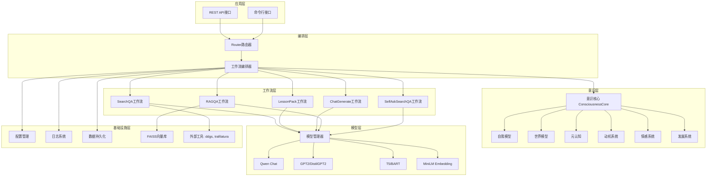
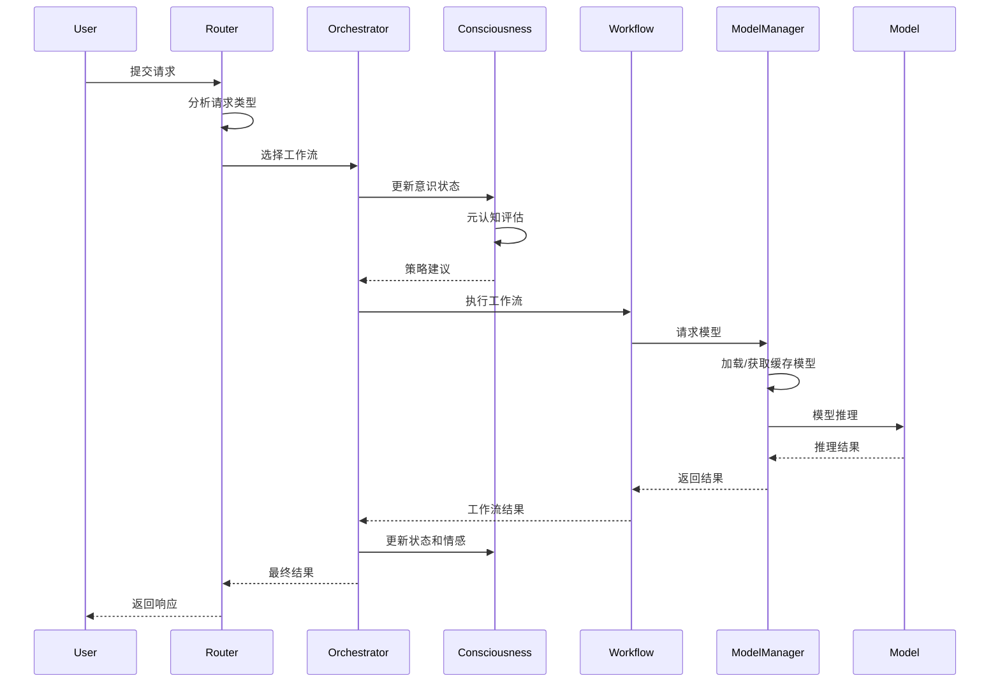

# 设计文档：MuAI多模型编排系统

## 概述

MuAI多模型编排系统是一个模块化的通用AI系统，采用分层架构设计，将工作流编排、意识模块、模型管理和基础设施服务解耦。系统的核心设计理念是：

1. **模块化与可扩展性**: 每个功能模块独立设计，通过清晰的接口交互
2. **意识驱动**: 意识模块系统贯穿整个处理流程，提供自我认知和元认知能力
3. **工作流编排**: 通过Router智能路由和工作流编排器实现灵活的任务处理
4. **资源优化**: 智能的模型加载和缓存机制，支持GPU/CPU混合部署
5. **渐进式发展**: 通过发展阶段系统实现从简单到复杂的能力演进

系统采用Python实现，使用PyTorch和HuggingFace Transformers作为核心框架，支持在NVIDIA T4/A100 GPU上运行。

## 架构

### 系统分层架构



### 核心数据流



## 组件与接口

### 1. Router路由器

**职责**: 分析用户请求并选择最合适的工作流

**接口**:
```python
class Router:
    def route(self, request: UserRequest) -> WorkflowSelection:
        """
        分析请求并返回工作流选择
        
        Args:
            request: 用户请求对象，包含query、context等
            
        Returns:
            WorkflowSelection: 包含workflow_type、confidence、parameters
        """
        pass
    
    def classify_intent(self, query: str) -> IntentType:
        """
        分类用户意图
        
        Args:
            query: 用户查询文本
            
        Returns:
            IntentType: 意图类型枚举
        """
        pass
```

**实现策略**:
- 基于规则的分类器（关键词匹配、正则表达式）
- 可选：使用轻量级分类模型（如DistilBERT）进行意图识别
- 置信度评分机制，低置信度时返回多个候选

### 2. 工作流编排器

**职责**: 协调工作流执行、意识模块交互和资源管理

**接口**:
```python
class WorkflowOrchestrator:
    def execute_workflow(
        self, 
        workflow_type: WorkflowType, 
        parameters: Dict[str, Any]
    ) -> WorkflowResult:
        """
        执行指定的工作流
        
        Args:
            workflow_type: 工作流类型
            parameters: 工作流参数
            
        Returns:
            WorkflowResult: 包含result、metadata、status
        """
        pass
    
    def register_workflow(self, workflow: BaseWorkflow) -> None:
        """注册新的工作流"""
        pass
```

### 3. 意识核心系统

**职责**: 管理所有意识模块，提供统一的意识接口

**接口**:
```python
class ConsciousnessCore:
    def __init__(self):
        self.self_model = SelfModel()
        self.world_model = WorldModel()
        self.metacognition = Metacognition()
        self.motivation = MotivationSystem()
        self.emotion = EmotionSystem()
        self.development = DevelopmentSystem()
    
    def update_state(self, event: SystemEvent) -> None:
        """更新意识状态"""
        pass
    
    def get_strategy_suggestion(self, task: Task) -> StrategySuggestion:
        """基于元认知提供策略建议"""
        pass
    
    def evaluate_result(self, result: Any, expected: Any) -> Evaluation:
        """评估任务结果并更新情感和动机"""
        pass
```

**子模块设计**:

- **SelfModel**: 维护能力清单、当前状态、性能历史
- **WorldModel**: 维护知识图谱、环境模型、用户模型
- **Metacognition**: 监控任务执行、评估策略有效性、提供调整建议
- **MotivationSystem**: 管理目标层次、计算目标优先级、驱动行为选择
- **EmotionSystem**: 计算情感状态（valence, arousal）、影响响应风格
- **DevelopmentSystem**: 管理发展阶段、解锁功能、记录成长数据

### 4. 工作流基类与具体实现

**基类接口**:
```python
class BaseWorkflow(ABC):
    @abstractmethod
    def execute(self, parameters: Dict[str, Any]) -> WorkflowResult:
        """执行工作流的核心逻辑"""
        pass
    
    @abstractmethod
    def validate_parameters(self, parameters: Dict[str, Any]) -> bool:
        """验证参数有效性"""
        pass
    
    def get_required_models(self) -> List[str]:
        """返回所需的模型列表"""
        pass
```

**具体工作流**:

#### SearchQA工作流
```python
class SearchQAWorkflow(BaseWorkflow):
    """
    搜索问答工作流: 搜索 → 抓取 → 摘要 → 回答
    
    步骤:
    1. 使用ddgs搜索相关网页
    2. 使用trafilatura抓取网页内容
    3. 使用T5/BART生成摘要
    4. 使用Qwen Chat基于摘要生成答案
    """
    def execute(self, parameters: Dict[str, Any]) -> WorkflowResult:
        query = parameters['query']
        # 1. 搜索
        search_results = self.search_engine.search(query, max_results=5)
        # 2. 抓取
        contents = [self.scraper.fetch(url) for url in search_results]
        # 3. 摘要
        summaries = [self.summarizer.summarize(content) for content in contents]
        # 4. 生成答案
        answer = self.qa_model.generate(query, context=summaries)
        return WorkflowResult(result=answer, metadata={...})
```

#### LessonPack工作流
```python
class LessonPackWorkflow(BaseWorkflow):
    """
    教学包工作流: 课题 → 教案 → 讲解 → 练习题
    
    步骤:
    1. 生成教学计划大纲
    2. 扩展为详细讲解内容
    3. 生成配套练习题和答案
    """
    def execute(self, parameters: Dict[str, Any]) -> WorkflowResult:
        topic = parameters['topic']
        # 1. 生成教学计划
        plan = self.planner.generate_plan(topic)
        # 2. 生成讲解
        explanation = self.explainer.generate_explanation(plan)
        # 3. 生成练习题
        exercises = self.exercise_generator.generate(topic, plan)
        return WorkflowResult(
            result={
                'plan': plan,
                'explanation': explanation,
                'exercises': exercises
            }
        )
```

#### ChatGenerate工作流
```python
class ChatGenerateWorkflow(BaseWorkflow):
    """
    多轮对话工作流: 检索历史 → 生成回复 → 更新历史
    
    步骤:
    1. 检索对话历史
    2. 构建上下文
    3. 生成回复
    4. 更新对话历史
    """
    def execute(self, parameters: Dict[str, Any]) -> WorkflowResult:
        session_id = parameters['session_id']
        message = parameters['message']
        # 1. 检索历史
        history = self.storage.get_chat_history(session_id, limit=10)
        # 2. 生成回复
        response = self.chat_model.generate(message, history=history)
        # 3. 更新历史
        self.storage.append_chat_history(session_id, message, response)
        return WorkflowResult(result=response)
```

#### RAGQA工作流
```python
class RAGQAWorkflow(BaseWorkflow):
    """
    RAG问答工作流: 向量检索 → 上下文构建 → 生成答案
    
    步骤:
    1. 将问题转换为向量
    2. 从FAISS检索相关文档片段
    3. 基于检索到的上下文生成答案
    """
    def execute(self, parameters: Dict[str, Any]) -> WorkflowResult:
        query = parameters['query']
        # 1. 向量化
        query_vector = self.embedding_model.encode(query)
        # 2. 检索
        docs = self.vector_db.search(query_vector, top_k=5)
        # 3. 生成答案
        answer = self.qa_model.generate(query, context=docs)
        return WorkflowResult(
            result=answer,
            metadata={'sources': [doc.metadata for doc in docs]}
        )
```

#### SelfAskSearchQA工作流
```python
class SelfAskSearchQAWorkflow(BaseWorkflow):
    """
    自问自答搜索问答: 分解问题 → 逐个搜索 → 综合答案
    
    步骤:
    1. 将复杂问题分解为子问题
    2. 对每个子问题执行SearchQA
    3. 综合所有子答案生成最终答案
    """
    def execute(self, parameters: Dict[str, Any]) -> WorkflowResult:
        query = parameters['query']
        # 1. 分解问题
        sub_questions = self.decomposer.decompose(query)
        # 2. 逐个搜索
        sub_answers = []
        for sub_q in sub_questions:
            result = self.search_qa_workflow.execute({'query': sub_q})
            sub_answers.append(result.result)
        # 3. 综合答案
        final_answer = self.synthesizer.synthesize(query, sub_answers)
        return WorkflowResult(result=final_answer)
```

### 5. 模型管理器

**职责**: 管理模型的加载、缓存、卸载和推理

**接口**:
```python
class ModelManager:
    def load_model(self, model_name: str, device: str = 'auto') -> Model:
        """
        加载模型到内存
        
        Args:
            model_name: 模型标识符
            device: 'cuda', 'cpu', 'auto'
            
        Returns:
            Model: 加载的模型对象
        """
        pass
    
    def get_model(self, model_name: str) -> Model:
        """获取模型（从缓存或加载）"""
        pass
    
    def unload_model(self, model_name: str) -> None:
        """卸载模型释放内存"""
        pass
    
    def infer(self, model_name: str, inputs: Any) -> Any:
        """执行模型推理"""
        pass
```

**实现策略**:
- LRU缓存机制，最多缓存3个模型
- 自动设备选择：优先GPU，内存不足时降级CPU
- 支持模型量化（8bit/4bit）以节省内存
- 延迟加载：仅在首次使用时加载

### 6. 向量库管理器

**职责**: 管理FAISS向量库的创建、索引和检索

**接口**:
```python
class VectorDBManager:
    def create_index(self, dimension: int, index_type: str = 'flat') -> None:
        """创建向量索引"""
        pass
    
    def add_documents(self, documents: List[Document]) -> None:
        """添加文档到向量库"""
        pass
    
    def search(self, query_vector: np.ndarray, top_k: int = 5) -> List[Document]:
        """检索最相关的文档"""
        pass
    
    def save_index(self, path: str) -> None:
        """持久化索引"""
        pass
    
    def load_index(self, path: str) -> None:
        """加载索引"""
        pass
```

## 数据模型

### 核心数据结构

```python
from dataclasses import dataclass
from typing import Any, Dict, List, Optional
from enum import Enum

class WorkflowType(Enum):
    SEARCH_QA = "search_qa"
    LESSON_PACK = "lesson_pack"
    CHAT_GENERATE = "chat_generate"
    RAG_QA = "rag_qa"
    SELF_ASK_SEARCH_QA = "self_ask_search_qa"

class IntentType(Enum):
    QUESTION_ANSWERING = "qa"
    TEACHING = "teaching"
    CONVERSATION = "conversation"
    KNOWLEDGE_QUERY = "knowledge"
    COMPLEX_REASONING = "reasoning"

@dataclass
class UserRequest:
    """用户请求"""
    query: str
    context: Optional[Dict[str, Any]] = None
    session_id: Optional[str] = None
    preferences: Optional[Dict[str, Any]] = None

@dataclass
class WorkflowSelection:
    """工作流选择结果"""
    workflow_type: WorkflowType
    confidence: float
    parameters: Dict[str, Any]
    alternatives: Optional[List['WorkflowSelection']] = None

@dataclass
class WorkflowResult:
    """工作流执行结果"""
    result: Any
    metadata: Dict[str, Any]
    status: str  # 'success', 'partial', 'failed'
    error: Optional[str] = None

@dataclass
class Document:
    """文档片段"""
    content: str
    metadata: Dict[str, Any]
    embedding: Optional[np.ndarray] = None

@dataclass
class ChatMessage:
    """对话消息"""
    role: str  # 'user', 'assistant', 'system'
    content: str
    timestamp: float
    metadata: Optional[Dict[str, Any]] = None

@dataclass
class ConsciousnessState:
    """意识状态"""
    self_state: Dict[str, Any]  # 自我模型状态
    world_state: Dict[str, Any]  # 世界模型状态
    emotion_state: Dict[str, float]  # 情感状态 (valence, arousal)
    motivation_state: Dict[str, Any]  # 动机状态
    development_stage: str  # 发展阶段
    metacognition_metrics: Dict[str, float]  # 元认知指标

@dataclass
class LessonPack:
    """教学包"""
    topic: str
    plan: str
    explanation: str
    exercises: List[Dict[str, str]]  # [{'question': ..., 'answer': ...}]
    metadata: Dict[str, Any]
```

### 配置数据模型

```python
@dataclass
class ModelConfig:
    """模型配置"""
    name: str
    model_path: str
    device: str = 'auto'
    quantization: Optional[str] = None  # '8bit', '4bit'
    max_length: int = 512
    temperature: float = 0.7

@dataclass
class SystemConfig:
    """系统配置"""
    models: Dict[str, ModelConfig]
    vector_db_path: str
    storage_path: str
    log_level: str = 'INFO'
    max_cached_models: int = 3
    development_stage: str = 'adult'
```


## 正确性属性

*属性是一种特征或行为，应该在系统的所有有效执行中保持为真——本质上是关于系统应该做什么的形式化陈述。属性作为人类可读规范和机器可验证正确性保证之间的桥梁。*

### 属性1：工作流路由一致性

*对于任何*用户请求，Router路由器应该返回一个有效的WorkflowSelection对象，其中workflow_type必须是WorkflowType枚举中的一个值，且confidence值在0到1之间。

**验证需求**: 需求1.1, 9.1, 9.2, 9.3

### 属性2：工作流执行步骤顺序

*对于任何*工作流类型和有效参数，工作流编排器执行该工作流时应该按照预定义的步骤顺序调用相应的组件，且每个步骤的输出应该作为下一个步骤的输入。

**验证需求**: 需求1.2, 2.1, 2.2, 2.3, 2.4

### 属性3：错误处理一致性

*对于任何*工作流执行过程中发生的异常，系统应该捕获该异常、记录到日志系统、并返回包含error字段的WorkflowResult对象，其status字段应为'failed'或'partial'。

**验证需求**: 需求1.3, 15.1, 15.4

### 属性4：结果结构完整性

*对于任何*成功执行的工作流，返回的WorkflowResult对象应该包含非空的result字段、metadata字典和status='success'。

**验证需求**: 需求1.4

### 属性5：SearchQA降级策略

*对于任何*SearchQA工作流执行，当任意步骤（搜索、抓取、摘要、生成）失败时，系统应该尝试降级策略（如跳过失败的URL、使用部分结果），最终返回的WorkflowResult的status应为'partial'而非'failed'。

**验证需求**: 需求2.5, 15.1

### 属性6：教学包结构完整性

*对于任何*课题输入，LessonPack工作流返回的结果应该包含plan、explanation和exercises三个字段，且exercises应该是一个列表，每个元素包含question和answer字段。

**验证需求**: 需求3.1, 3.2, 3.3, 3.5

### 属性7：对话会话唯一性

*对于任何*两次独立的对话发起请求，系统应该生成不同的session_id，且每个session_id应该是全局唯一的。

**验证需求**: 需求4.1

### 属性8：对话历史上下文传递

*对于任何*在已有会话中发送的消息，生成回复时传递给模型的输入应该包含该会话的历史对话记录（至少包含最近的消息）。

**验证需求**: 需求4.2, 4.3

### 属性9：对话历史持久化

*对于任何*对话会话，在添加新消息后，从存储中检索该会话的历史应该包含刚添加的消息，且历史记录数量应该至少保留最近10轮对话。

**验证需求**: 需求4.4, 14.1

### 属性10：对话历史滑动窗口

*对于任何*对话会话，当历史记录超过最大长度限制时，检索到的历史应该只包含最近的N条记录（N为配置的窗口大小），且最旧的记录应该被移除。

**验证需求**: 需求4.5

### 属性11：文档向量化完整性

*对于任何*上传的文档，系统应该将其分块、为每个块生成向量嵌入，且所有向量应该被添加到FAISS索引中，索引的大小应该增加相应的块数量。

**验证需求**: 需求5.1, 5.2

### 属性12：RAG检索相关性

*对于任何*RAG问答请求，检索到的文档片段数量应该等于请求的top_k值（或索引中的文档总数，如果少于top_k），且每个片段应该包含content和metadata字段。

**验证需求**: 需求5.3

### 属性13：RAG答案来源标注

*对于任何*RAG问答的结果，返回的WorkflowResult的metadata字段应该包含'sources'键，其值应该是一个列表，包含用于生成答案的文档片段的元数据。

**验证需求**: 需求5.4, 5.5

### 属性14：意识模块初始化完整性

*对于任何*ConsciousnessCore的实例化，该实例应该包含所有六个子模块的非空引用：self_model、world_model、metacognition、motivation、emotion、development。

**验证需求**: 需求6.1

### 属性15：意识模块状态维护

*对于任何*意识模块（自我模型、世界模型），在系统运行过程中，这些模块应该维护可访问的状态字典，且状态应该可以被更新和查询。

**验证需求**: 需求6.3, 6.4

### 属性16：元认知策略建议

*对于任何*任务请求，当调用意识核心的get_strategy_suggestion方法时，应该返回一个StrategySuggestion对象，包含对任务处理的建议。

**验证需求**: 需求6.5

### 属性17：动机系统目标更新

*对于任何*任务完成事件，动机系统的目标状态应该被更新，且相关目标的完成状态或优先级应该发生变化。

**验证需求**: 需求7.1, 7.2

### 属性18：情感状态计算

*对于任何*任务结果，情感系统应该计算新的情感状态值（valence和arousal），且这些值应该在合理的范围内（例如-1到1或0到1）。

**验证需求**: 需求7.3

### 属性19：情感影响处理策略

*对于任何*两个具有不同情感状态的系统状态，在相同的任务输入下，处理策略（如响应风格、温度参数）应该有所不同。

**验证需求**: 需求7.4, 7.5

### 属性20：发展阶段功能限制

*对于任何*发展阶段，当系统处于该阶段时，尝试使用该阶段未解锁的功能应该被拒绝或返回错误，而已解锁的功能应该可以正常使用。

**验证需求**: 需求8.3

### 属性21：发展阶段晋升

*对于任何*发展阶段，当满足该阶段的晋升条件时，调用发展系统的评估方法应该触发阶段升级，且当前阶段应该变更为下一个阶段。

**验证需求**: 需求8.4

### 属性22：发展数据记录

*对于任何*发展阶段，系统应该记录该阶段的学习数据和性能指标，且这些数据应该可以被查询和导出。

**验证需求**: 需求8.5

### 属性23：Router低置信度处理

*对于任何*路由决策，当confidence值低于阈值（如0.6）时，返回的WorkflowSelection应该包含非空的alternatives列表，列出其他可能的工作流选项。

**验证需求**: 需求9.4

### 属性24：模型延迟加载

*对于任何*模型，在系统启动时该模型不应该被加载到内存，只有在首次调用get_model或infer方法时才应该触发加载。

**验证需求**: 需求10.1

### 属性25：模型设备选择

*对于任何*模型加载请求，当device参数为'auto'时，如果CUDA可用且GPU内存充足，模型应该被加载到GPU；否则应该加载到CPU。

**验证需求**: 需求10.2, 10.3

### 属性26：模型缓存复用

*对于任何*模型，当该模型已经在缓存中时，再次请求该模型应该直接返回缓存的实例，而不应该重新加载。

**验证需求**: 需求10.4

### 属性27：模型LRU淘汰

*对于任何*模型管理器，当缓存的模型数量超过max_cached_models限制时，最久未使用的模型应该被卸载以释放内存。

**验证需求**: 需求10.5

### 属性28：配置格式支持

*对于任何*有效的YAML或JSON格式的配置文件，系统应该能够成功解析并加载配置，且加载后的配置对象应该包含所有必需的字段。

**验证需求**: 需求11.1, 11.2

### 属性29：配置默认值回退

*对于任何*配置项，当该项在配置文件中缺失时，系统应该使用预定义的默认值，且不应该抛出异常。

**验证需求**: 需求11.3

### 属性30：日志结构化格式

*对于任何*系统日志记录，日志输出应该是结构化的（如JSON格式），包含timestamp、level、message、context等标准字段，且应该可以被解析为字典对象。

**验证需求**: 需求12.1, 9.5, 11.5

### 属性31：日志级别过滤

*对于任何*日志级别配置，当设置为特定级别（如WARNING）时，低于该级别的日志（如DEBUG、INFO）不应该被输出，而高于或等于该级别的日志应该被输出。

**验证需求**: 需求12.2

### 属性32：错误日志完整性

*对于任何*捕获的异常，记录的错误日志应该包含异常类型、错误消息、完整的堆栈跟踪和发生错误时的上下文信息。

**验证需求**: 需求12.3, 15.4

### 属性33：性能指标收集

*对于任何*工作流执行，系统应该收集并记录性能指标（如响应时间、模型推理时间），且这些指标应该可以通过API查询。

**验证需求**: 需求12.4, 12.5

### 属性34：API JSON格式

*对于任何*API请求和响应，数据应该使用JSON格式编码，且Content-Type头应该为'application/json'。

**验证需求**: 需求13.2

### 属性35：API错误响应格式

*对于任何*格式错误的API请求，响应应该包含清晰的错误信息（error字段）、适当的HTTP状态码（4xx或5xx），且响应体应该是有效的JSON。

**验证需求**: 需求13.3, 15.3

### 属性36：API认证保护

*对于任何*需要认证的API端点，未提供有效认证凭据的请求应该被拒绝，返回401或403状态码。

**验证需求**: 需求13.4

### 属性37：向量库持久化往返

*对于任何*向量库索引，保存到磁盘后再加载，加载后的索引应该包含相同数量的向量，且对相同查询的检索结果应该一致。

**验证需求**: 需求14.2

### 属性38：意识状态持久化往返

*对于任何*意识模块状态，保存到磁盘后再加载，加载后的状态应该与保存前的状态等价（所有关键字段值相同）。

**验证需求**: 需求14.3, 14.4

### 属性39：数据导出导入往返

*对于任何*系统数据（对话历史、向量库、配置），导出后再导入，导入后的数据应该与导出前的数据等价。

**验证需求**: 需求14.5

### 属性40：网络请求重试次数

*对于任何*网络请求超时，系统应该最多重试3次，且在第3次失败后应该返回超时错误而不是继续重试。

**验证需求**: 需求15.2

### 属性41：严重错误安全关闭

*对于任何*严重错误（如内存溢出、系统资源耗尽），系统应该在关闭前保存当前的意识状态和关键数据，且保存操作应该成功完成。

**验证需求**: 需求15.5

## 错误处理

### 错误分类

系统将错误分为以下几类：

1. **输入验证错误**: 用户输入格式错误、参数缺失、类型不匹配
2. **资源错误**: 模型加载失败、GPU内存不足、磁盘空间不足
3. **网络错误**: 搜索超时、网页抓取失败、API调用失败
4. **模型推理错误**: 模型输出格式错误、推理超时、模型崩溃
5. **系统错误**: 未捕获的异常、配置错误、依赖缺失

### 错误处理策略

```python
class ErrorHandler:
    def handle_error(self, error: Exception, context: Dict[str, Any]) -> ErrorResponse:
        """
        统一错误处理入口
        
        策略:
        1. 记录错误到日志系统（包含堆栈和上下文）
        2. 根据错误类型选择处理策略
        3. 返回用户友好的错误信息
        """
        # 记录错误
        logger.error(
            "Error occurred",
            error_type=type(error).__name__,
            error_message=str(error),
            stack_trace=traceback.format_exc(),
            context=context
        )
        
        # 分类处理
        if isinstance(error, ValidationError):
            return self._handle_validation_error(error)
        elif isinstance(error, ResourceError):
            return self._handle_resource_error(error)
        elif isinstance(error, NetworkError):
            return self._handle_network_error(error)
        elif isinstance(error, ModelError):
            return self._handle_model_error(error)
        else:
            return self._handle_system_error(error)
```

### 降级策略

1. **模型降级**: Qwen Chat → GPT2 → 规则生成
2. **搜索降级**: 网络搜索失败 → 使用本地知识库 → 返回"无法获取信息"
3. **设备降级**: GPU → CPU → 量化模型
4. **功能降级**: 完整工作流 → 简化工作流 → 基础响应

### 重试机制

```python
class RetryPolicy:
    """重试策略配置"""
    max_retries: int = 3
    backoff_factor: float = 2.0  # 指数退避
    retry_on: List[Type[Exception]] = [NetworkError, TimeoutError]
    
    def should_retry(self, error: Exception, attempt: int) -> bool:
        """判断是否应该重试"""
        return (
            type(error) in self.retry_on and
            attempt < self.max_retries
        )
    
    def get_delay(self, attempt: int) -> float:
        """计算重试延迟"""
        return self.backoff_factor ** attempt
```

## 测试策略

### 双重测试方法

系统采用单元测试和基于属性的测试相结合的方法：

- **单元测试**: 验证特定示例、边缘情况和错误条件
- **基于属性的测试**: 验证所有输入的通用属性

两者是互补的，对于全面覆盖都是必要的。

### 单元测试平衡

单元测试有助于特定示例和边缘情况，但应避免编写过多的单元测试——基于属性的测试可以处理大量输入的覆盖。单元测试应该专注于：

- 演示正确行为的特定示例
- 组件之间的集成点
- 边缘情况和错误条件

基于属性的测试应该专注于：

- 对所有输入都成立的通用属性
- 通过随机化实现全面的输入覆盖

### 基于属性的测试配置

系统使用**Hypothesis**库（Python的属性测试框架）进行基于属性的测试：

```python
from hypothesis import given, strategies as st
import pytest

# 配置：每个属性测试最少100次迭代
@pytest.fixture(autouse=True)
def hypothesis_settings():
    from hypothesis import settings
    settings.register_profile("default", max_examples=100)
    settings.load_profile("default")
```

### 测试标签格式

每个基于属性的测试必须使用注释引用其设计文档属性：

```python
@given(request=st.builds(UserRequest, query=st.text(min_size=1)))
def test_router_returns_valid_workflow_selection(request):
    """
    Feature: muai-orchestration-system, Property 1: 工作流路由一致性
    
    对于任何用户请求，Router应该返回有效的WorkflowSelection对象
    """
    router = Router()
    result = router.route(request)
    
    assert isinstance(result, WorkflowSelection)
    assert result.workflow_type in WorkflowType
    assert 0 <= result.confidence <= 1
```

### 测试组织

```
tests/
├── unit/                          # 单元测试
│   ├── test_router.py
│   ├── test_workflows.py
│   ├── test_consciousness.py
│   ├── test_model_manager.py
│   └── test_vector_db.py
├── property/                      # 基于属性的测试
│   ├── test_workflow_properties.py
│   ├── test_consciousness_properties.py
│   ├── test_persistence_properties.py
│   └── test_error_handling_properties.py
├── integration/                   # 集成测试
│   ├── test_end_to_end_workflows.py
│   └── test_api_endpoints.py
└── fixtures/                      # 测试夹具和数据
    ├── sample_configs.py
    ├── mock_models.py
    └── test_data.py
```

### 关键测试场景

#### 1. 工作流测试

**单元测试**:
- 测试SearchQA工作流的每个步骤
- 测试LessonPack生成的教学包格式
- 测试ChatGenerate的历史检索

**基于属性的测试**:
- 属性2: 工作流执行步骤顺序
- 属性4: 结果结构完整性
- 属性5: SearchQA降级策略

#### 2. 意识模块测试

**单元测试**:
- 测试意识核心初始化
- 测试自我模型状态更新
- 测试情感系统的特定情感计算

**基于属性的测试**:
- 属性14: 意识模块初始化完整性
- 属性15: 意识模块状态维护
- 属性18: 情感状态计算

#### 3. 持久化测试

**单元测试**:
- 测试对话历史保存和加载
- 测试向量库索引保存

**基于属性的测试**:
- 属性37: 向量库持久化往返
- 属性38: 意识状态持久化往返
- 属性39: 数据导出导入往返

#### 4. 错误处理测试

**单元测试**:
- 测试特定的错误场景（如GPU内存不足）
- 测试API错误响应格式

**基于属性的测试**:
- 属性3: 错误处理一致性
- 属性40: 网络请求重试次数
- 属性41: 严重错误安全关闭

### 测试数据生成策略

使用Hypothesis的策略生成测试数据：

```python
from hypothesis import strategies as st

# 用户请求策略
user_request_strategy = st.builds(
    UserRequest,
    query=st.text(min_size=1, max_size=500),
    context=st.none() | st.dictionaries(st.text(), st.text()),
    session_id=st.none() | st.uuids().map(str)
)

# 工作流类型策略
workflow_type_strategy = st.sampled_from(WorkflowType)

# 对话消息策略
chat_message_strategy = st.builds(
    ChatMessage,
    role=st.sampled_from(['user', 'assistant', 'system']),
    content=st.text(min_size=1, max_size=1000),
    timestamp=st.floats(min_value=0, max_value=2e9)
)

# 文档策略
document_strategy = st.builds(
    Document,
    content=st.text(min_size=10, max_size=5000),
    metadata=st.dictionaries(st.text(), st.text())
)
```

### 性能测试

除了功能测试，还应该包括性能测试：

1. **模型推理延迟**: 测量各模型的推理时间
2. **工作流端到端延迟**: 测量完整工作流的执行时间
3. **内存使用**: 监控模型加载和缓存的内存占用
4. **并发处理**: 测试系统处理并发请求的能力

### 测试覆盖率目标

- 代码覆盖率: ≥80%
- 属性测试覆盖: 所有41个正确性属性
- 边缘情况覆盖: 所有已知的边缘情况和错误条件

