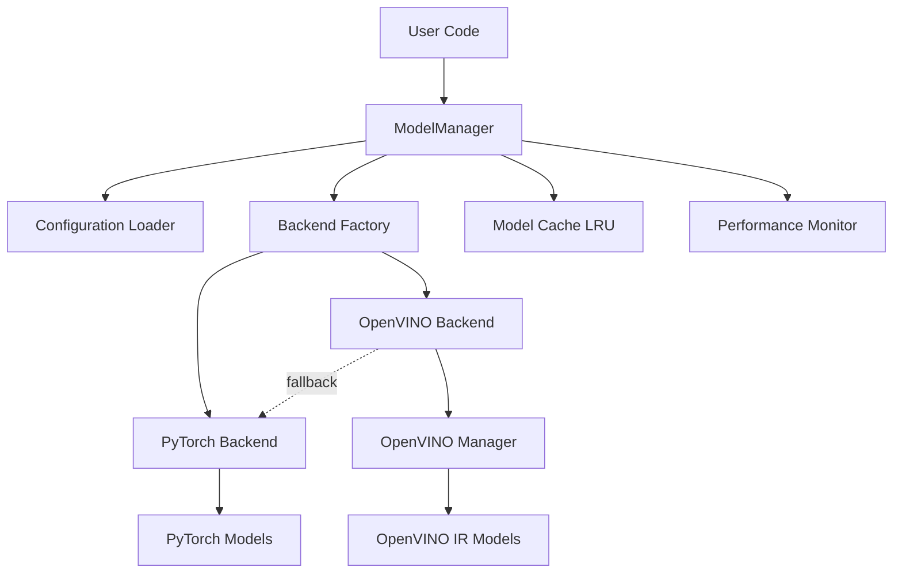
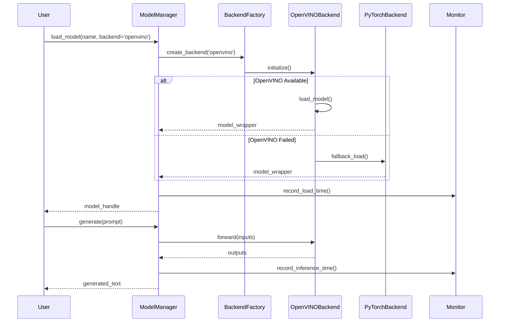

# Design Document: OpenVINO Backend Integration

## Overview

This design integrates OpenVINO as an optional inference backend into the existing MuAI Multi-Model Orchestration System. The integration provides 2-3x performance improvements for CPU-based inference while maintaining full backward compatibility with PyTorch.

The design follows a strategy pattern where ModelManager acts as a facade, delegating to either PyTorchBackend or OpenVINOBackend based on configuration. This approach ensures a unified interface while allowing backend-specific optimizations.

### Key Design Goals

1. **Zero Breaking Changes**: Existing code works without modification
2. **Opt-in Adoption**: Users explicitly choose OpenVINO via configuration
3. **Graceful Degradation**: Automatic fallback to PyTorch on OpenVINO failures
4. **Performance Transparency**: Built-in monitoring and comparison capabilities
5. **Simple Configuration**: Intuitive YAML-based backend selection

## Architecture

### High-Level Architecture



### Component Interaction Flow



## Components and Interfaces

### 1. ModelManager (Enhanced)

The existing ModelManager is enhanced to support multiple backends while maintaining its current API.

**New Attributes:**
```python
class ModelManager:
    def __init__(
        self,
        device: str = "cpu",
        max_cached_models: int = 3,
        backend: str = "pytorch",  # NEW
        backend_config: Optional[Dict[str, Any]] = None  # NEW
    ):
        self.device = device
        self.max_cached_models = max_cached_models
        self.backend_type = backend
        self.backend_config = backend_config or {}
        self._backend_factory = BackendFactory()
        self._model_cache: OrderedDict = OrderedDict()
        self._performance_monitor = PerformanceMonitor()
```

**Key Methods (Unchanged Signatures):**
```python
def load_model(
    self,
    model_name: str,
    model_type: str,
    backend_override: Optional[str] = None  # NEW optional parameter
) -> Any:
    """Load model using configured or specified backend."""
    pass

def get_model(self, model_name: str) -> Any:
    """Get cached model (backend-agnostic)."""
    pass

def generate(
    self,
    model_name: str,
    prompt: str,
    max_length: int = 100,
    **kwargs
) -> str:
    """Generate text using loaded model (backend-agnostic)."""
    pass
```

### 2. BackendFactory (New)

Factory for creating backend instances based on configuration.

```python
class BackendFactory:
    """Factory for creating inference backends."""
    
    def create_backend(
        self,
        backend_type: str,
        device: str,
        config: Dict[str, Any]
    ) -> InferenceBackend:
        """
        Create backend instance.
        
        Args:
            backend_type: 'pytorch' or 'openvino'
            device: Target device ('cpu', 'gpu', 'auto')
            config: Backend-specific configuration
            
        Returns:
            InferenceBackend instance
            
        Raises:
            ValueError: If backend_type is invalid
            RuntimeError: If backend initialization fails
        """
        if backend_type == "pytorch":
            return PyTorchBackend(device, config)
        elif backend_type == "openvino":
            return OpenVINOBackend(device, config)
        else:
            raise ValueError(f"Unknown backend: {backend_type}")
    
    def get_available_backends(self) -> List[str]:
        """Return list of available backends on this system."""
        backends = ["pytorch"]
        try:
            import openvino
            backends.append("openvino")
        except ImportError:
            pass
        return backends
```

### 3. InferenceBackend (Abstract Base Class)

Defines the interface all backends must implement.

```python
from abc import ABC, abstractmethod
from typing import Any, Dict, List, Optional

class InferenceBackend(ABC):
    """Abstract base class for inference backends."""
    
    def __init__(self, device: str, config: Dict[str, Any]):
        self.device = device
        self.config = config
        self._models: Dict[str, Any] = {}
    
    @abstractmethod
    def load_model(
        self,
        model_name: str,
        model_path: str,
        model_type: str
    ) -> Any:
        """Load model from path."""
        pass
    
    @abstractmethod
    def forward(
        self,
        model: Any,
        inputs: Dict[str, Any]
    ) -> Dict[str, Any]:
        """Run inference."""
        pass
    
    @abstractmethod
    def generate(
        self,
        model: Any,
        tokenizer: Any,
        prompt: str,
        max_length: int,
        **kwargs
    ) -> str:
        """Generate text."""
        pass
    
    @abstractmethod
    def unload_model(self, model_name: str) -> None:
        """Unload model from memory."""
        pass
    
    @abstractmethod
    def get_model_info(self, model: Any) -> Dict[str, Any]:
        """Get model metadata."""
        pass
    
    def is_available(self) -> bool:
        """Check if backend is available on this system."""
        return True
```

### 4. PyTorchBackend (New Wrapper)

Wraps existing PyTorch functionality into the backend interface.

```python
class PyTorchBackend(InferenceBackend):
    """PyTorch inference backend."""
    
    def __init__(self, device: str, config: Dict[str, Any]):
        super().__init__(device, config)
        self.torch_device = torch.device(device)
    
    def load_model(
        self,
        model_name: str,
        model_path: str,
        model_type: str
    ) -> Any:
        """Load PyTorch model."""
        if model_type == "transformers":
            from transformers import AutoModelForCausalLM
            model = AutoModelForCausalLM.from_pretrained(
                model_path,
                torch_dtype=torch.float32
            )
            model.to(self.torch_device)
            model.eval()
            return model
        else:
            raise ValueError(f"Unsupported model type: {model_type}")
    
    def forward(
        self,
        model: Any,
        inputs: Dict[str, Any]
    ) -> Dict[str, Any]:
        """Run PyTorch inference."""
        with torch.no_grad():
            outputs = model(**inputs)
        return {"logits": outputs.logits}
    
    def generate(
        self,
        model: Any,
        tokenizer: Any,
        prompt: str,
        max_length: int,
        **kwargs
    ) -> str:
        """Generate text with PyTorch."""
        inputs = tokenizer(prompt, return_tensors="pt")
        inputs = {k: v.to(self.torch_device) for k, v in inputs.items()}
        
        with torch.no_grad():
            outputs = model.generate(
                **inputs,
                max_length=max_length,
                **kwargs
            )
        
        return tokenizer.decode(outputs[0], skip_special_tokens=True)
    
    def unload_model(self, model_name: str) -> None:
        """Unload PyTorch model."""
        if model_name in self._models:
            del self._models[model_name]
            if torch.cuda.is_available():
                torch.cuda.empty_cache()
    
    def get_model_info(self, model: Any) -> Dict[str, Any]:
        """Get PyTorch model info."""
        return {
            "backend": "pytorch",
            "device": str(self.torch_device),
            "parameters": sum(p.numel() for p in model.parameters())
        }
```

### 5. OpenVINOBackend (New)

Integrates the existing OpenVINO_Manager into the backend interface.

```python
class OpenVINOBackend(InferenceBackend):
    """OpenVINO inference backend."""
    
    def __init__(self, device: str, config: Dict[str, Any]):
        super().__init__(device, config)
        self._openvino_manager = None
        self._fallback_backend = None
        self._initialize_openvino()
    
    def _initialize_openvino(self) -> None:
        """Initialize OpenVINO manager with fallback."""
        try:
            from mm_orch.runtime.openvino_manager import OpenVINO_Manager
            self._openvino_manager = OpenVINO_Manager(device=self.device)
        except Exception as e:
            logger.warning(f"OpenVINO initialization failed: {e}")
            if self.config.get("enable_fallback", True):
                logger.info("Falling back to PyTorch backend")
                self._fallback_backend = PyTorchBackend(
                    self.device if self.device == "cpu" else "cpu",
                    self.config
                )
            else:
                raise RuntimeError(f"OpenVINO backend unavailable: {e}")
    
    def load_model(
        self,
        model_name: str,
        model_path: str,
        model_type: str
    ) -> Any:
        """Load OpenVINO model with fallback."""
        if self._openvino_manager is None:
            if self._fallback_backend:
                return self._fallback_backend.load_model(
                    model_name, model_path, model_type
                )
            raise RuntimeError("OpenVINO backend not initialized")
        
        try:
            # Convert model_path to OpenVINO IR path
            ov_model_path = self._get_openvino_path(model_path)
            
            if not os.path.exists(ov_model_path):
                raise FileNotFoundError(
                    f"OpenVINO model not found: {ov_model_path}. "
                    f"Please export the model first."
                )
            
            model = self._openvino_manager.load_model(
                model_name=model_name,
                model_path=ov_model_path
            )
            self._models[model_name] = model
            return model
            
        except Exception as e:
            logger.warning(f"OpenVINO model loading failed: {e}")
            if self._fallback_backend:
                logger.info(f"Falling back to PyTorch for {model_name}")
                return self._fallback_backend.load_model(
                    model_name, model_path, model_type
                )
            raise
    
    def forward(
        self,
        model: Any,
        inputs: Dict[str, Any]
    ) -> Dict[str, Any]:
        """Run OpenVINO inference with fallback."""
        if self._is_fallback_model(model):
            return self._fallback_backend.forward(model, inputs)
        
        try:
            return self._openvino_manager.infer(model, inputs)
        except Exception as e:
            logger.error(f"OpenVINO inference failed: {e}")
            raise
    
    def generate(
        self,
        model: Any,
        tokenizer: Any,
        prompt: str,
        max_length: int,
        **kwargs
    ) -> str:
        """Generate text with OpenVINO."""
        if self._is_fallback_model(model):
            return self._fallback_backend.generate(
                model, tokenizer, prompt, max_length, **kwargs
            )
        
        try:
            return self._openvino_manager.generate(
                model=model,
                tokenizer=tokenizer,
                prompt=prompt,
                max_length=max_length,
                **kwargs
            )
        except Exception as e:
            logger.error(f"OpenVINO generation failed: {e}")
            raise
    
    def unload_model(self, model_name: str) -> None:
        """Unload OpenVINO model."""
        if model_name in self._models:
            del self._models[model_name]
    
    def get_model_info(self, model: Any) -> Dict[str, Any]:
        """Get OpenVINO model info."""
        if self._is_fallback_model(model):
            return self._fallback_backend.get_model_info(model)
        
        return {
            "backend": "openvino",
            "device": self.device,
            "model_type": "IR"
        }
    
    def is_available(self) -> bool:
        """Check if OpenVINO is available."""
        return self._openvino_manager is not None
    
    def _get_openvino_path(self, pytorch_path: str) -> str:
        """Convert PyTorch model path to OpenVINO IR path."""
        # Example: models/gpt2 -> models/openvino/gpt2
        base_dir = os.path.dirname(pytorch_path)
        model_name = os.path.basename(pytorch_path)
        return os.path.join(base_dir, "openvino", model_name)
    
    def _is_fallback_model(self, model: Any) -> bool:
        """Check if model is from fallback backend."""
        return (self._fallback_backend is not None and 
                not hasattr(model, 'compiled_model'))
```

### 6. ConfigurationLoader (New)

Handles loading and validation of backend configuration.

```python
class BackendConfig:
    """Backend configuration container."""
    
    def __init__(self, config_path: Optional[str] = None):
        self.config_path = config_path or "config/system.yaml"
        self._config = self._load_config()
    
    def _load_config(self) -> Dict[str, Any]:
        """Load configuration from YAML file."""
        if not os.path.exists(self.config_path):
            return self._get_default_config()
        
        try:
            with open(self.config_path, 'r') as f:
                config = yaml.safe_load(f)
            return self._validate_config(config)
        except Exception as e:
            logger.warning(f"Config loading failed: {e}, using defaults")
            return self._get_default_config()
    
    def _get_default_config(self) -> Dict[str, Any]:
        """Get default configuration."""
        return {
            "backend": {
                "default": "pytorch",
                "openvino": {
                    "device": "CPU",
                    "enable_fallback": True,
                    "cache_dir": "models/openvino"
                },
                "pytorch": {
                    "device": "cpu"
                }
            },
            "model_overrides": {}
        }
    
    def _validate_config(self, config: Dict[str, Any]) -> Dict[str, Any]:
        """Validate configuration values."""
        if "backend" not in config:
            config["backend"] = self._get_default_config()["backend"]
        
        backend_config = config["backend"]
        
        # Validate default backend
        default_backend = backend_config.get("default", "pytorch")
        if default_backend not in ["pytorch", "openvino"]:
            logger.warning(f"Invalid default backend: {default_backend}")
            backend_config["default"] = "pytorch"
        
        # Validate OpenVINO device
        if "openvino" in backend_config:
            ov_device = backend_config["openvino"].get("device", "CPU")
            if ov_device not in ["CPU", "GPU", "AUTO"]:
                logger.warning(f"Invalid OpenVINO device: {ov_device}")
                backend_config["openvino"]["device"] = "CPU"
        
        return config
    
    def get_default_backend(self) -> str:
        """Get default backend name."""
        return self._config["backend"]["default"]
    
    def get_backend_config(self, backend: str) -> Dict[str, Any]:
        """Get configuration for specific backend."""
        return self._config["backend"].get(backend, {})
    
    def get_model_backend(self, model_name: str) -> Optional[str]:
        """Get backend override for specific model."""
        return self._config.get("model_overrides", {}).get(model_name)
```

### 7. PerformanceMonitor (Enhanced)

Enhanced to track backend-specific metrics.

```python
class PerformanceMonitor:
    """Monitor and compare backend performance."""
    
    def __init__(self):
        self._metrics: Dict[str, List[float]] = defaultdict(list)
        self._backend_stats: Dict[str, Dict[str, Any]] = {}
    
    def record_inference(
        self,
        backend: str,
        model_name: str,
        latency: float,
        tokens: int
    ) -> None:
        """Record inference metrics."""
        key = f"{backend}:{model_name}"
        self._metrics[f"{key}:latency"].append(latency)
        self._metrics[f"{key}:throughput"].append(tokens / latency)
    
    def get_backend_stats(self, backend: str) -> Dict[str, Any]:
        """Get aggregated statistics for backend."""
        latencies = []
        throughputs = []
        
        for key, values in self._metrics.items():
            if key.startswith(f"{backend}:"):
                if ":latency" in key:
                    latencies.extend(values)
                elif ":throughput" in key:
                    throughputs.extend(values)
        
        if not latencies:
            return {}
        
        return {
            "backend": backend,
            "avg_latency": np.mean(latencies),
            "p50_latency": np.percentile(latencies, 50),
            "p95_latency": np.percentile(latencies, 95),
            "avg_throughput": np.mean(throughputs),
            "sample_count": len(latencies)
        }
    
    def compare_backends(
        self,
        backend1: str,
        backend2: str
    ) -> Dict[str, Any]:
        """Compare performance between two backends."""
        stats1 = self.get_backend_stats(backend1)
        stats2 = self.get_backend_stats(backend2)
        
        if not stats1 or not stats2:
            return {}
        
        return {
            "latency_improvement": (
                stats1["avg_latency"] / stats2["avg_latency"]
            ),
            "throughput_improvement": (
                stats2["avg_throughput"] / stats1["avg_throughput"]
            ),
            f"{backend1}_stats": stats1,
            f"{backend2}_stats": stats2
        }
```

## Data Models

### Configuration Schema

```yaml
# config/system.yaml
backend:
  # Default backend for all models
  default: pytorch  # or 'openvino'
  
  # OpenVINO-specific configuration
  openvino:
    device: CPU  # CPU, GPU, or AUTO
    enable_fallback: true
    cache_dir: models/openvino
    num_streams: 1  # Parallel inference streams
    
  # PyTorch-specific configuration
  pytorch:
    device: cpu  # cpu or cuda
    dtype: float32

# Per-model backend overrides
model_overrides:
  gpt2: openvino
  t5-small: pytorch
  
# Model paths
models:
  gpt2:
    pytorch_path: models/gpt2
    openvino_path: models/openvino/gpt2
```

### Backend Metadata

```python
@dataclass
class BackendMetadata:
    """Metadata about a loaded backend."""
    backend_type: str  # 'pytorch' or 'openvino'
    device: str
    is_fallback: bool
    load_time: float
    model_info: Dict[str, Any]
```

### Performance Metrics

```python
@dataclass
class InferenceMetrics:
    """Metrics for a single inference."""
    backend: str
    model_name: str
    latency_ms: float
    tokens_generated: int
    throughput_tokens_per_sec: float
    timestamp: datetime
```

## Data Flow

### Model Loading Flow

1. User calls `ModelManager.load_model(name, backend='openvino')`
2. ModelManager checks configuration for backend override
3. ModelManager calls BackendFactory to create backend instance
4. Backend validates model files exist
5. Backend loads model (with fallback on failure)
6. ModelManager caches model with backend metadata
7. PerformanceMonitor records load time
8. Return model handle to user

### Inference Flow

1. User calls `ModelManager.generate(model_name, prompt)`
2. ModelManager retrieves model from cache
3. ModelManager delegates to appropriate backend
4. Backend tokenizes input
5. Backend runs inference
6. Backend decodes output
7. PerformanceMonitor records metrics
8. Return generated text to user

### Fallback Flow

1. OpenVINOBackend attempts operation
2. Operation fails with exception
3. Backend checks if fallback is enabled
4. Backend logs warning with failure reason
5. Backend delegates to PyTorchBackend
6. PyTorchBackend completes operation
7. PerformanceMonitor records fallback event
8. Return result to caller


## Correctness Properties

*A property is a characteristic or behavior that should hold true across all valid executions of a system—essentially, a formal statement about what the system should do. Properties serve as the bridge between human-readable specifications and machine-verifiable correctness guarantees.*

### Property 1: Backend Parameter Validation

*For any* backend parameter value passed to ModelManager initialization, the system should accept valid values ('pytorch', 'openvino') and reject invalid values with descriptive errors.

**Validates: Requirements 1.1, 1.3**

### Property 2: Configuration Loading and Validation

*For any* valid configuration file content, the system should correctly parse and apply backend settings, and for any invalid configuration, the system should either reject it with clear errors or fall back to safe defaults.

**Validates: Requirements 2.1, 2.2, 2.6**

### Property 3: Per-Model Backend Override

*For any* model with a backend override in configuration, the system should use the override backend instead of the default backend for that specific model.

**Validates: Requirements 2.3**

### Property 4: Device Configuration Consistency

*For any* valid device configuration (CPU, GPU, AUTO), the OpenVINO backend should respect the device setting and use it for model loading and inference.

**Validates: Requirements 2.4, 6.1**

### Property 5: Backward Compatibility Preservation

*For any* existing code that uses ModelManager without the new backend parameter, the system should behave identically to the pre-integration implementation, producing the same outputs and maintaining the same API signatures.

**Validates: Requirements 3.1, 3.2, 3.3, 3.4**

### Property 6: Automatic Fallback on Failure

*For any* operation (model loading or inference) that fails in the OpenVINO backend when fallback is enabled, the system should automatically retry the operation using the PyTorch backend and log the fallback event.

**Validates: Requirements 4.1, 4.2, 4.3, 4.4**

### Property 7: Fallback Disable Behavior

*For any* operation that fails in the OpenVINO backend when fallback is disabled in configuration, the system should raise the original error without attempting PyTorch fallback.

**Validates: Requirements 4.5**

### Property 8: Backend Interface Uniformity

*For any* inference operation (generate, forward) and any valid input, both PyTorch and OpenVINO backends should provide the same method signatures, accept the same parameters, and return results in the same format structure.

**Validates: Requirements 5.1, 5.2, 5.3, 5.4, 5.5**

### Property 9: Device Fallback on Unavailability

*For any* requested OpenVINO device that is unavailable on the system, the backend should fall back to CPU device with a warning logged.

**Validates: Requirements 6.3**

### Property 10: Performance Metrics Recording

*For any* inference operation on any backend, the system should record latency, throughput, and backend information in the performance monitoring system, making these metrics accessible through the monitoring API.

**Validates: Requirements 7.1, 7.2, 7.3, 7.4**

### Property 11: Model Export Validation

*For any* PyTorch model exported to OpenVINO IR format, the export process should validate that the resulting model can be loaded and produces outputs, and should support multiple precision levels (FP32, FP16, INT8).

**Validates: Requirements 8.2, 8.3**

### Property 12: Export Directory Structure

*For any* model exported to OpenVINO format, the exported files should follow the established directory structure convention (models/openvino/{model_name}).

**Validates: Requirements 8.4**

### Property 13: Pre-Load File Validation

*For any* OpenVINO model load request, the system should validate that the required model files exist before attempting to load them, and should provide clear error messages if files are missing.

**Validates: Requirements 9.3**

## Error Handling

### Error Categories

1. **Configuration Errors**
   - Invalid backend name
   - Invalid device name
   - Malformed configuration file
   - Missing required configuration fields

2. **Initialization Errors**
   - OpenVINO not installed
   - OpenVINO initialization failure
   - Device unavailable
   - Backend factory errors

3. **Model Loading Errors**
   - Model files not found
   - Model format incompatible
   - Insufficient memory
   - Device allocation failure

4. **Inference Errors**
   - Invalid input format
   - Model execution failure
   - Tokenization errors
   - Output decoding errors

### Error Handling Strategy

```python
class BackendError(Exception):
    """Base exception for backend errors."""
    pass

class BackendInitializationError(BackendError):
    """Raised when backend initialization fails."""
    pass

class ModelLoadError(BackendError):
    """Raised when model loading fails."""
    pass

class InferenceError(BackendError):
    """Raised when inference fails."""
    pass

class ConfigurationError(BackendError):
    """Raised when configuration is invalid."""
    pass
```

### Error Recovery Patterns

1. **Graceful Degradation**: Fall back to PyTorch when OpenVINO fails
2. **Retry with Backoff**: Retry transient failures with exponential backoff
3. **Clear Diagnostics**: Provide actionable error messages with troubleshooting steps
4. **Fail Fast**: Validate early to catch errors before expensive operations

### Example Error Messages

```python
# Good error message
"OpenVINO backend initialization failed: OpenVINO library not found. "
"Install with: pip install openvino openvino-dev. "
"Falling back to PyTorch backend."

# Good error message
"Model file not found: models/openvino/gpt2/gpt2.xml. "
"Export the model first using: python scripts/export_to_openvino.py gpt2. "
"Available models: gpt2 (pytorch), t5-small (pytorch)"

# Good error message
"OpenVINO device 'GPU' not available on this system. "
"Available devices: CPU. Falling back to CPU."
```

## Testing Strategy

### Dual Testing Approach

This feature requires both unit tests and property-based tests for comprehensive coverage:

- **Unit tests**: Verify specific examples, edge cases, and error conditions
- **Property tests**: Verify universal properties across all inputs using Hypothesis

Both testing approaches are complementary and necessary. Unit tests catch concrete bugs in specific scenarios, while property tests verify general correctness across a wide range of inputs.

### Property-Based Testing Configuration

- **Library**: Hypothesis (Python property-based testing library)
- **Iterations**: Minimum 100 iterations per property test
- **Tagging**: Each property test must reference its design document property
- **Tag format**: `# Feature: openvino-backend-integration, Property {number}: {property_text}`

### Test Organization

```
tests/
├── unit/
│   ├── test_backend_factory.py
│   ├── test_pytorch_backend.py
│   ├── test_openvino_backend.py
│   ├── test_configuration_loader.py
│   └── test_performance_monitor.py
├── property/
│   ├── test_backend_properties.py
│   ├── test_configuration_properties.py
│   ├── test_fallback_properties.py
│   └── test_interface_properties.py
└── integration/
    ├── test_end_to_end_pytorch.py
    ├── test_end_to_end_openvino.py
    ├── test_backend_switching.py
    └── test_fallback_scenarios.py
```

### Key Test Scenarios

**Unit Tests:**
1. Backend factory creates correct backend instances
2. Configuration loader handles missing files gracefully
3. PyTorch backend wraps existing functionality correctly
4. OpenVINO backend initializes with correct device
5. Performance monitor calculates metrics correctly
6. Fallback triggers on expected error conditions
7. Model cache works with both backends
8. Export utility creates valid OpenVINO models

**Property Tests:**
1. Backend parameter validation (Property 1)
2. Configuration parsing and validation (Property 2)
3. Per-model override behavior (Property 3)
4. Device configuration consistency (Property 4)
5. Backward compatibility (Property 5)
6. Automatic fallback (Property 6)
7. Fallback disable behavior (Property 7)
8. Interface uniformity (Property 8)
9. Device fallback (Property 9)
10. Metrics recording (Property 10)
11. Export validation (Property 11)
12. Directory structure (Property 12)
13. File validation (Property 13)

**Integration Tests:**
1. End-to-end workflow with PyTorch backend
2. End-to-end workflow with OpenVINO backend
3. Switching backends mid-session
4. Fallback from OpenVINO to PyTorch
5. Multiple models with different backends
6. Performance comparison between backends
7. Configuration changes without restart

### Test Data Strategy

- **Model Fixtures**: Small test models (distilgpt2) for fast testing
- **Configuration Fixtures**: Valid and invalid configuration examples
- **Mock Backends**: Simulated backends for testing fallback logic
- **Performance Baselines**: Expected performance ranges for validation

### Backward Compatibility Testing

Critical requirement: All existing tests must pass without modification.

**Validation approach:**
1. Run existing test suite without any configuration changes
2. Verify all tests pass with default (PyTorch) backend
3. Verify no API changes break existing code
4. Verify model outputs are identical to pre-integration

### Performance Testing

**Benchmarks to track:**
1. Model loading time (both backends)
2. Inference latency (both backends)
3. Throughput tokens/second (both backends)
4. Memory usage (both backends)
5. Fallback overhead

**Success criteria:**
- OpenVINO backend: 2-3x faster than PyTorch on CPU
- Fallback overhead: < 100ms
- Memory usage: Similar or better than PyTorch
- No performance regression for PyTorch backend

## Migration Guide

### For Existing Users (No Changes Required)

Existing code continues to work without modification:

```python
# This code works exactly as before
from mm_orch.runtime.model_manager import ModelManager

manager = ModelManager(device="cpu")
model = manager.load_model("gpt2", "transformers")
output = manager.generate("gpt2", "Hello world")
```

### Opting Into OpenVINO

**Option 1: Programmatic Selection**

```python
from mm_orch.runtime.model_manager import ModelManager

# Use OpenVINO for all models
manager = ModelManager(
    device="cpu",
    backend="openvino"
)

# Or specify per model
model = manager.load_model(
    "gpt2",
    "transformers",
    backend_override="openvino"
)
```

**Option 2: Configuration File**

```yaml
# config/system.yaml
backend:
  default: openvino
  openvino:
    device: CPU
    enable_fallback: true

model_overrides:
  gpt2: openvino
  t5-small: pytorch
```

### Exporting Models to OpenVINO

```bash
# Export a single model
python scripts/export_to_openvino.py gpt2 --precision FP32

# Export with different precision
python scripts/export_to_openvino.py gpt2 --precision FP16

# Export all models
python scripts/export_to_openvino.py --all
```

### Performance Comparison

```python
from mm_orch.runtime.model_manager import ModelManager

# Create managers with different backends
pytorch_manager = ModelManager(backend="pytorch")
openvino_manager = ModelManager(backend="openvino")

# Load same model in both
pytorch_manager.load_model("gpt2", "transformers")
openvino_manager.load_model("gpt2", "transformers")

# Compare performance
pytorch_stats = pytorch_manager.get_performance_stats("gpt2")
openvino_stats = openvino_manager.get_performance_stats("gpt2")

comparison = pytorch_manager.compare_backends(
    "pytorch",
    "openvino"
)
print(f"Speedup: {comparison['throughput_improvement']:.2f}x")
```

### Troubleshooting

**OpenVINO not found:**
```bash
pip install openvino openvino-dev
```

**Model files not found:**
```bash
python scripts/export_to_openvino.py gpt2
```

**GPU not available:**
```yaml
# config/system.yaml
backend:
  openvino:
    device: CPU  # Fall back to CPU
```

**Fallback to PyTorch:**
Check logs for warnings:
```python
import logging
logging.basicConfig(level=logging.WARNING)
```

## Implementation Notes

### Phase 1: Core Infrastructure
1. Create abstract InferenceBackend interface
2. Implement BackendFactory
3. Implement PyTorchBackend wrapper
4. Implement OpenVINOBackend with fallback
5. Update ModelManager to use backends

### Phase 2: Configuration and Monitoring
1. Implement ConfigurationLoader
2. Enhance PerformanceMonitor
3. Add backend selection logic
4. Add per-model overrides

### Phase 3: Tooling and Documentation
1. Create model export utility
2. Write migration guide
3. Create configuration examples
4. Add performance benchmarks

### Phase 4: Testing and Validation
1. Write unit tests for all components
2. Write property tests for all properties
3. Write integration tests
4. Validate backward compatibility
5. Performance benchmarking

### Dependencies

**Required:**
- openvino >= 2023.0
- openvino-dev >= 2023.0 (for model export)
- torch >= 1.13.0
- transformers >= 4.30.0

**Optional:**
- hypothesis >= 6.0.0 (for property testing)
- pytest >= 7.0.0 (for testing)

### Compatibility Matrix

| Backend | Device | Supported | Performance |
|---------|--------|-----------|-------------|
| PyTorch | CPU | ✅ | Baseline |
| PyTorch | CUDA | ✅ | 5-10x |
| OpenVINO | CPU | ✅ | 2-3x |
| OpenVINO | GPU/iGPU | ✅ | 3-5x |
| OpenVINO | NPU | ⚠️ | Limited (static shapes only) |

### Performance Expectations

Based on testing with Intel Core Ultra 5 125H:

| Model | PyTorch CPU | OpenVINO CPU | Speedup |
|-------|-------------|--------------|---------|
| GPT-2 | 27-34 tok/s | 57 tok/s | 2.1-2.7x |
| DistilGPT-2 | 45-50 tok/s | 95 tok/s | ~2x |
| T5-small | 30-35 tok/s | 65 tok/s | ~2x |

### Security Considerations

1. **Model File Validation**: Validate model files before loading to prevent malicious models
2. **Configuration Validation**: Sanitize configuration inputs to prevent injection attacks
3. **Error Message Sanitization**: Avoid exposing sensitive paths in error messages
4. **Resource Limits**: Enforce memory and compute limits to prevent DoS
5. **Fallback Safety**: Ensure fallback doesn't bypass security checks
